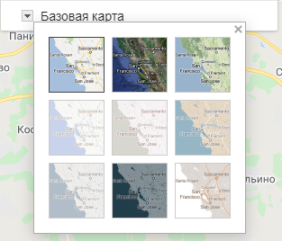
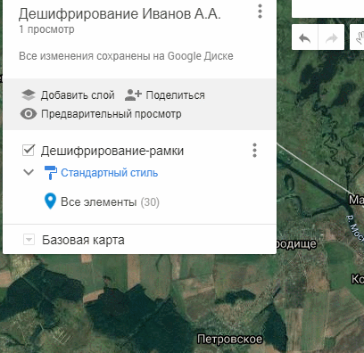

# Дешифрирование снимков {#interpretation}

## Краткая теоретическая информация {#interpretation-theory}
[В начало справки ⇡](#interpretation)

_Данные дистанционного зондирования_ – материалы космической или воздушной (аэро-) съёмки, представленные преимущественно снимками.

_Дешифрирование_ – распознавание и отрисовка в условных знаках объектов и явлений по данным дистанционного зондирования.

_Дешифровочный признак_ – некая особенная черта объекта, по которому он определяется по данным дистанционного зондирования.

_Прямые дешифровочные признаки_ – признаки самих объектов.

_Косвенные дешифровочные признаки_ – прямые дешифровочные признаки объектов-индикаторов.

_Признак формы (геометрический)_ – характерные формы объектов.

_Признак размера (геометрический)_ – абсолютный, но чаще относительный размер объекта.

_Признак тени (геометрический)_ – падающая тень объекта (на поверхности земли) или собственная тень объекта (его затенённая часть).

_Признак яркости (яркостный)_ – яркость объекта на снимки, зависящая от количества отражённого солнечного света.

_Признак цвета (яркостный)_ – совокупность яркостей объекта в синем, зелёном и красном диапазоне спектра.

_Спектральный образ (яркостный)_ – совокупность яркостей во всех диапазонах спектра (не только в видимом).

_Текстура (структурный)_ – сочетание неразличимых элементов изображения, формирующих единое целое.

_Структура (структурный)_ – сочетание различимых элементов изображения (несколько текстур).

_Рисунок (структурный)_ – сочетание нескольких текстур и структур.

## Исходные данные {#interpretation-data}
[В начало справки ⇡](#interpretation)

[Участки дешифрирования](https://yadi.sk/d/eOVRxRZiEh_PWQ){target="_blank"}

[Бланк работы](https://yadi.sk/i/x5atjx5eSHcTGw){target="_blank"}

## Цель работы {#interpretation-task}
[В начало справки ⇡](#interpretation)

Для своего участка снимка провести дешифрирование 10 типов объектов по мозаике космических снимков Google. Заполнить бланк, описав использованные дешифровочные признаки и дав расшифровку условных знаков.

## Работа с Google My Maps (Мои карты) {#interpretation-google}
[В начало справки ⇡](#interpretation)

Зайдите в свой аккаунт Google в браузере и пройдите по [ссылке](https://www.google.com/maps/d/u/0/?hl=ru){target="_blank"}. Google Мои карты – это специальный сервис для создания простых веб-карт, которыми можно поделиться с другими с помощью обычной ссылки. Для создания новой карты нажмите на большую кнопку слева **+СОЗДАТЬ НОВУЮ КАРТУ**. Откроется окно, которое будет выглядеть следующим образом:

По умолчанию ваша карта называется «Карта без названия». Вы можете поменять название, щёлкнув по нему слева вверху страницы. Чтобы импортировать данные, нужно нажать на кнопку **Импорт** и выбрать **KMZ** файл, который был вам ранее предоставлен. После добавления данных охват карты подстроится под эти данные. Для того чтобы ваша карта по умолчанию открывалась для конкретного охвата, нажмите на три точки возле заголовка и выберите пункт **Задать область просмотра по умолчанию**.

Выбрать мозаику спутниковых снимков можно в слое с базовой картой (в самом низу списка слоёв).

Для того чтобы задать стиль или настроить подписи для рамок, нажмите на кнопку настройки стиля под названием слоя. Его можно сделать либо индивидуальным, либо стандартным. Там же можно вывести подписи рамок по их названию.

Для отрисовки объектов на карте необходимо создать новый слой, нажав на кнопку **Добавить слой**. Этот слой можно назвать по типу объектов, которые будут в нем храниться. Приблизьтесь к объекту, который вы хотите отрисовать. Для начала собственно отрисовки выберите кнопку  под строкой поиска. Обратите внимание, что рисовка происходит в активном слое – у него слева синяя вертикальная полоска. Левой кнопкой мыши расставляются узлы объекты. Если это площадной объект, то последний узел нужно замкнуть на первый. Замыкание полигона автоматически завершает отрисовку объекта, после чего перед вами появляется окошко, где вы можете задать его название, а также стиль (цвет заливки, обводка, прозрачность). Завершить отрисовку линейного объекта можно двойным щелчком левой клавиши мыши.

Когда ваша карта будет готова, вы можете скопировать ссылку и прислать её преподавателю на проверку вместе с бланком. Для этого нажмите кнопку **Поделиться**. Включите общий доступ по ссылке к карте и скопируйте ссылку.

## Заполнение бланка {#interpretation-blank}
[В начало справки ⇡](#interpretation)

Бланк следует заполнить следующим образом по колонкам:

1) Условный знак;

2) Дешифрируемый объект;

3) перечисляются дешифровочные признаки, которые вы использовали (их, как правило, несколько!);

4) Классификационные особенности признаков, например, прямой геометрический, прямой яркостный, прямой структурный, либо косвенный геометрический и т.д.

5) Конкретный признак, по которому дешифрируется объект, то есть, если форма, то какая форма, если яркость, то какая яркость, если косвенный признак, то по какому объекту.

----
_Карпачевский А.М., Каргашин П.Е._ **Топография с основами геодезии**. М.: Географический факультет МГУ, `r lubridate::year(Sys.Date())`.
----