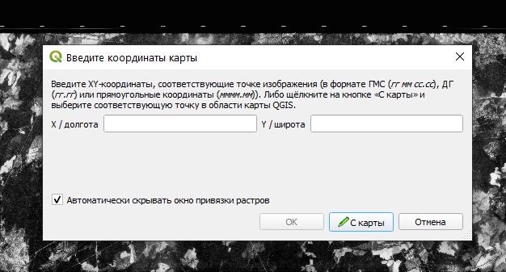

# Географическая привязка {#georeference}

## Географическая привязка в QGIS {#georeference-qgis}
[В начало справки ⇡](#georeference)

Для привязки данных дистанционного зондирования в QGIS можно использовать WMS-сервис с мозаикой спутниковых снимков. Для включения мозаики зайдите в меню **Модули – Управление и установка модулей...**. Впишите в строку поиска __QuickMapServices__. Установите модуль.

Откроется окно модуля. В окне поиска геосервиса введите __Google satelite__. Нажмите **Добавить**.

Добавьте в качестве слоя данных привязываемый снимок.

> Примечание: Если у вас такой панели не оказалось, это значит, что она отключена. Для включения панели щелкните правой кнопкой мыши по пустому месту на панели и найдите **панель работы со слоями**.

Включите **Панель инструментов работы с растровыми данными**. На ней нажмите кнопку **Привязка растров** .

Откроется окно привязки. Нажмите на кнопку **Открыть растр** , добавьте привязываемый растр. Щелчок левой кнопкой мыши по привязываемому изображению открое окно, куда будет предложено ввести координаты. Если вы для привязки хотите использовать референцное изображение, нажмите на кнопку **С карты**.

Для настройки параметров трансформации нажмите на кнопку . Опорные точки можно сохранять и подгружать – для этого используйте соответствующие кнопки на панели. Для запуска процесса трансформации нажмите на кнопку 

После добавления трансформированного изображения в основное окно карты убедитесь в правильности проделанной операции, сравнивая его с подложкой из мозаики спутниковых снимков. Для этого удобно использовать инструмент шторки.

Зайдите в **Модули – Управление и установка модулей...** и вбейте в поиск **MapSwipe Tool**. После этого появится панель шторки.

Выберите слой, который будет активен в режиме шторки (будет находиться под шторкой) и нажмите на кнопку .

----
_Карпачевский А.М._ **Фотограмметрия и основы дистанционного зондирования**. М.: Географический факультет МГУ, `r lubridate::year(Sys.Date())`.
----