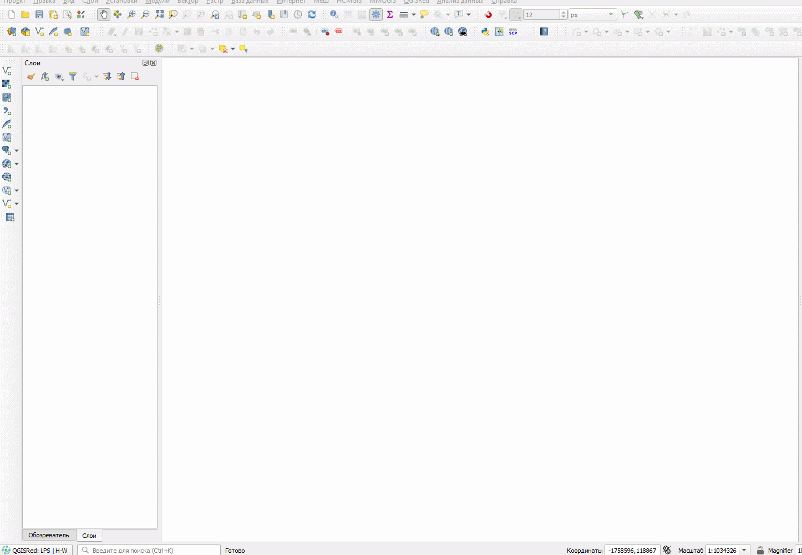

# Географическая привязка {#georeference}

## краткая теоретическая информация {#georeference-theory}
[В начало справки ⇡](#georeference)

## Исходные данные {#georeference-data}
[В начало справки ⇡](#georeference)

[Учебная топографическая карта масштаба 1:50 000](https://yadi.sk/i/S9s3TnLDzxgIQw){target="_blank"}

## Системы координат в QGIS {#coordinate-systems}
[В начало справки ⇡](#georeference)

## Привязка в QGIS {#georeference-qgis}
[В начало справки ⇡](#georeference)

Добавьте топографическую карту в проект

.

Включите **Панель инструментов работы с растровыми данными**. На ней нажмите кнопку **Привязка растров** .

Откроется окно привязки. Нажмите на кнопку **Открыть растр** , добавьте привязываемый растр. Щелчок левой кнопкой мыши по привязываемому изображению открое окно, куда будет предложено ввести координаты. Если вы для привязки хотите использовать референцное изображение, нажмите на кнопку **С карты**.

Для настройки параметров трансформации нажмите на кнопку . Опорные точки можно сохранять и подгружать – для этого используйте соответствующие кнопки на панели. Для запуска процесса трансформации нажмите на кнопку 

После добавления трансформированного изображения в основное окно карты убедитесь в правильности проделанной операции, сравнивая его с подложкой из мозаики спутниковых снимков. Для этого удобно использовать инструмент шторки.

Зайдите в **Модули – Управление и установка модулей...** и вбейте в поиск **MapSwipe Tool**. После этого появится панель шторки.

Выберите слой, который будет активен в режиме шторки (будет находиться под шторкой) и нажмите на кнопку .

----
_Карпачевский А.М., Каргашин П.Е._ **Топография с основами геодезии**. М.: Географический факультет МГУ, `r lubridate::year(Sys.Date())`.
----