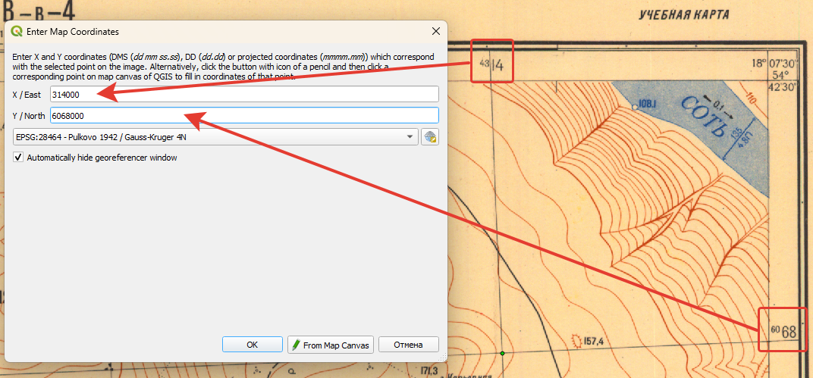
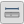

# Географическая привязка {#georeference}

## Краткая теоретическая информация {#georeference-theory}
[В начало справки ⇡](#georeference)

_Эллипсоид_ – математическая фигура,описывающая фигуру Земли и характеризующаяся параметрами малой и большой полуоси.

_Географическая (геодезическая) система координат_ – система координат на эллипсоиде, задающая счёт широтам и долготам в градусах, а также положение эллипсоида внутри тела земли.

_Спроецированная (прямоугольная) система координат_ – система координат проекции, определяющая ориентировку декартовых осей координат и их начало.

_Географическая привязка_ – сопоставление точек изображения и точек местности.

_Трансформация_ – перевод данных из одной системы координат в другую.
 
## Исходные данные {#georeference-data}
[В начало справки ⇡](#georeference)

[Учебная топографическая карта масштаба 1:25 000](https://yadi.sk/i/mvQ3lJJVNVJiuA){target="_blank"}

[Снимок №1](https://yadi.sk/i/Zo4U3AuslrxwAg){target="_blank"}

[Снимок №2](https://yadi.sk/i/_Yl8PMShZ-7FIw){target="_blank"}

[Снимок №3](https://yadi.sk/i/JKSSi97_dbu7Lg){target="_blank"}

[Бланк задания](https://yadi.sk/i/WDWZgCLA2A539Q){target="_blank"}

## Цель работы {#georeference-task}
[В начало справки ⇡](#georeference)

Привязать топографическую карту, а затем к ней привязать аэрофотоснимок. Оценить точность привязки карты и снимка. Определить детализацию снимку и соответствующий ей масштаб. Обосновать выбор опорных точек для привязки снимка, указав на отличия ситуации, отражённой на карте и на снимке.

## Системы координат в QGIS {#coordinate-systems}
[В начало справки ⇡](#georeference)

Системы координат в QGIS задаются в свойствах проекта. Для этого нужно открыть пункт меню **Проект – Свойства**.

Перейдите на вкладку **Системы координат**. В среднем окне видно две свёрнутые группы систем координат – географические и прямоугольные (спроецированные).

Если раскрыть эти группы, то вы увидите полный перечень систем координат по алфавиту. Например, поскольку известно, что для старых отечественных топографических карт используется проекция Гаусса-Крюгера на основе системы координат координат Пулково 1942 года, то можно пролистать перечень прямоугольных СК до Pulkovo 1942 и далее найти нужную зону проекции Гаусса-Крюгера нужной ширины (они бывают 3° и 6°). Также нужные проекции можно искать через строку поиска вверху окна.

## Привязка топографической карты {#georeference-topo}
[В начало справки ⇡](#georeference)

Добавьте топографическую карту в проект, нажав на кнопку .

Поскольку открытая карта на данный момент не привязана, справа от слоя в таблице слоёв вы увидите знак вопроса.

> Если вы не видите карту, то, вероятно, она расположилась где-то за пределами вашего экрана. Чтобы увидеть её, нажмите правой кнопкой мыши по слою и выберете **Увеличить до слоя**. Обратите внимание на значения координат и масштаб внизу окна. Что они могут означать?

Запустите модуль привязки через меню **Layer – Georeferencer** (**Слои – Привязка растров...**).

> Если вы не видите такого пункта меню, то зайдите в **Установки – Модули и управление модулями**, вбейте в поиск «привязка» и включите соответствующий модуль, поставив галочку.

Откроется отдельное окно привязки. Нажмите на кнопку **Открыть растр** , добавьте привязываемый растр. Щелчок левой кнопкой мыши по привязываемому изображению откроет окно, куда будет предложено ввести координаты. Выберите пересечения линий прямоугольной сетки в качестве точек с известными прямоугольными координатами.

> Обратите внимание, что оси X и Y в геоинформационном программном обеспечении ориентированы как в математике. Для координаты X вводить номер зоны **не нужно**.

Введите не менее 5 точек равномерно по всей карте – обычно это углы и центр листа. Внизу окна появится таблица с вашими точками привязки – будут указаны координаты этих точек в исходной СК изображения и в целевой СК, а также невязки. Далее необходимо указать способ трансформации для расчёта невязок. Нажмите на кнопку . В качестве типа трансформации для топографических карт должно быть достаточно полиномиального первой степени. Укажите целевую систему координат (в которой вводились координаты точек), а также путь для сохраняемого файла.

> Сохраняйте файлы в папку с путями без латиницы, пробелов и спецсимволов.

После указания типа трансформации в таблице внизу должны появиться расчётные невязки. Убедитесь в том, что невязки имеют значение менее пикселя. Если невязка более пикселя, нужно удалить неправильную опорную точку, нажав на кнопку  и выбрав точку на карте. Для добавления новой точки выберите кнопку . Когда точность трансформации станет удовлетворительной, запустите сам процесс трансформации, нажав на кнопку . Закройте модуль привязки.

## Привязка аэрофотоснимков {#georeference-aerial}
[В начало справки ⇡](#georeference)

Привязка материалов аэрофотосъёмки происходит аналогично, но в качестве опорных точек выступают соответственные точки на топографической карте. Для этого нужно сопоставить снимок с картой и найти эти точки. В модуле привязке выберите точку, но при появлении окна не вводите координаты, а выберите кнопку **С карты**.

Расставьте минимум 5 точек равномерно по всему снимку. В параметрах преобразования укажите тип трансформации – **проективное**. Именно такое преобразование используется для аэрофотоснимков.

## Измерения по карте и снимку {#georeference-measure}
[В начало справки ⇡](#georeference)

Для измерений по карте или по снимку используется инструмент линейки , расположенный на панели атрибутов. Если у вас такой панели нет, её можно открыть, щёлкнув правой кнопкой мыши по пустому месту сверху.

----
_Карпачевский А.М., Каргашин П.Е._ **Топография с основами геодезии**. М.: Географический факультет МГУ, `r lubridate::year(Sys.Date())`.
----