# Использование QGIS во время полевой топографической практики {#practice}

В этой справке вы найдёте информацию об основных технических приёмах работе в ГИС-пакете QGIS на учебной топографической практике. Для универсализации терминов, названий функций и элементов интерфейса в справке используется англоязычный пользовательский интерфейс. О том, как менять язык программы, вы можете узнать в [начальном разделе](https://iowq750.github.io/Topography/#global){target="_blank"}.

## Создание схемы теодолитного хода {#practice-theod}

### Шаблон схемы теодолитного хода {#practice-theod-template}

[Схема теодолитного хода в формате PDF](https://disk.yandex.ru/i/Z3H_BOK2KYfDRQ){target="_blank"}

[Проект шаблона схемы теодолитного хода для QGIS](https://disk.yandex.ru/d/JcXRhKuiqoVTLg){target="_blank"}

### Работа с базой данных {#practice-theod-DB}
[В начало справки ⇡](#practice-theod)

Для схемы теодолитного хода следует создать отдельную базу данных, в которой будет несколько классов объектов:

●	Стороны хода

●	Дуги внутренних углов хода

●	Точки хода.

Создать базу данных можно, нажав правой кнопкой по выбранной вами директории в браузере (проводнике). Выберите пункт меню **New – Geopackage**.

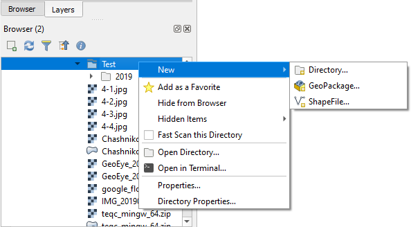

У вас откроется окно создания базы данных, где вы можете задать имя базы данных, сразу же создать один из классов, указав его тип геометрии и систему координат.

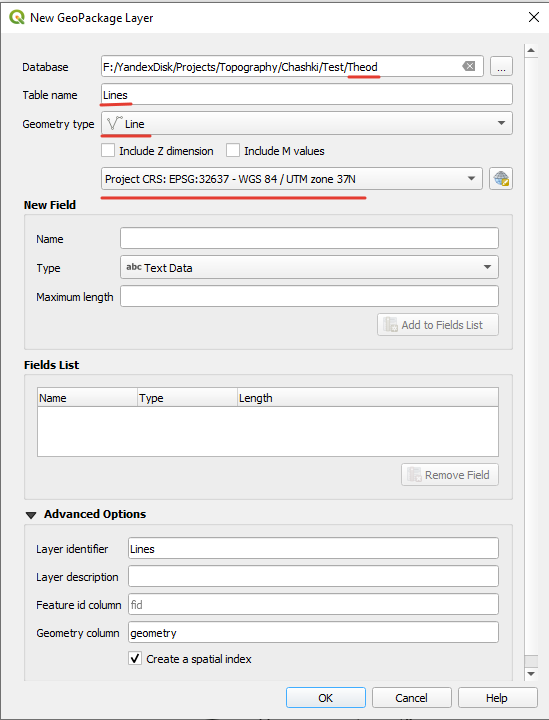

Остальные классы объектов вы можете создать, щёлкнув правой кнопкой мыши по уже созданной базе данных и выбрав пункт меню **New Table**.

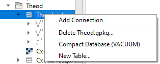

### Черчение хода {#practice-theod-draw}
[В начало справки ⇡](#practice-theod)

Для нанесение точек хода необходимо добавить в проект из базы данных точечный класс объектов простым перетаскиванием, либо дважды щёлкнув по ним в Браузере. Для редактирования объектов и добавления новых объектов в класс необходимо войти в режим редактирования. Для этого можно щелкнуть правой кнопкой мыши по слою и выбрать пункт **Режим редактирования** (**Toggle Editing**), либо выделить слой и найти на панели инструментов кнопку . Активация режима редактирования откроет некоторые другие кнопки на панелях. Например, для точечного класса объекта появится кнопка 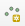. Нажав на эту кнопку, вы сможете поставить точку в произвольном месте.

Чтобы поставить точки по строго заданным (рассчитанным при уравнивании теодолитного хода) координатам необходимо использовать панель **Advanced Digitizing Panel**. Если она не открыта, щёлкните правой кнопкой мыши по пустому месту сверху основного окна QGIS и в выпадающем списке отметьте панель и окно.

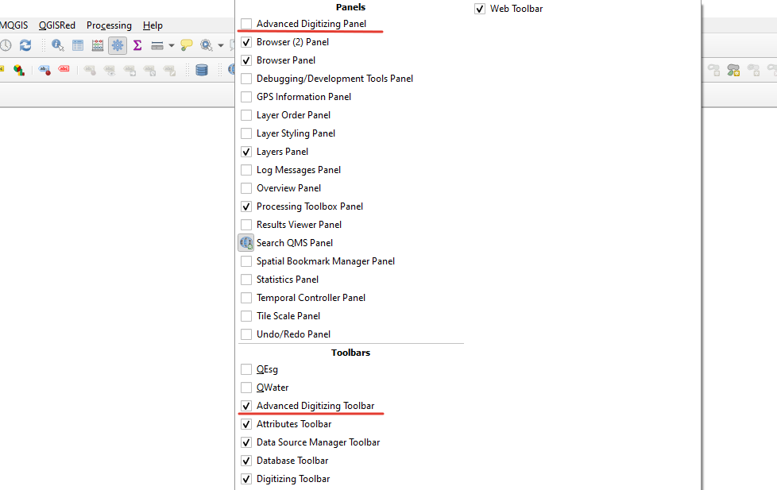

Нажмите на кнопку активации инструментов 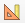. Введите координаты *X* и *Y*, закрепляя их замком (или нажатием на **Enter**). Щёлкните левой кнопкой мыши по карте – новая точка установится строго по заданным координатам. Сохраните изменения, нажав на иконку сохранения  на панели редактирования.

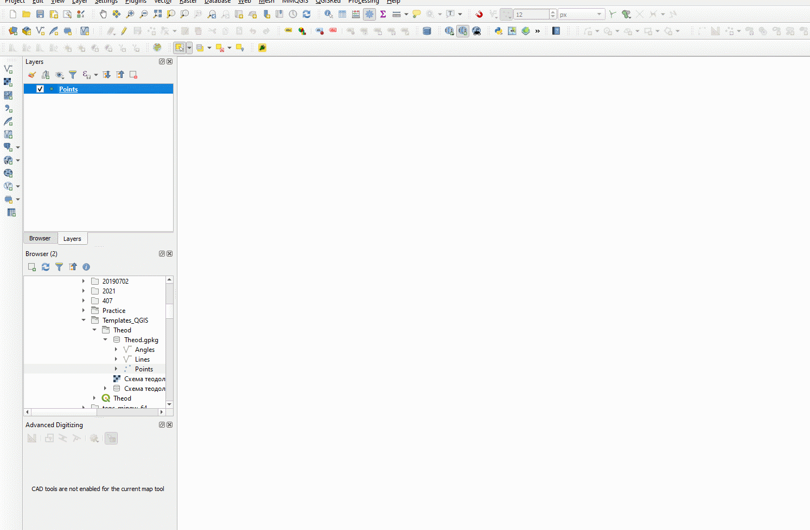

Для отрисовки сторон хода нужно зайти в режим редактирования соответствующего слоя. При векторизации объектов часто возникает необходимость пристыковать вершины одного объекта к вершинам другого объекта. Для корректной и комфортной пристыковки нужно включить панель Инструментов прилипания (**snapping**). Кнопка в виде магнита  активирует прилипание. Остальные кнопки на данной панели позволяют уточнить параметры прилипания, в том числе расстояние, на котором оно начинает действовать. Отрисуйте стороны с включенным режимом прилипания, нажимая на левую кнопку мыши для установки вершин и завершая отрисовку правой кнопкой мыши. Сохраните изменения.

> Обратите внимание, что каждая сторона теодолитного хода должна быть отдельным объектом.

Для черчения дуг углов включите панель **Shape Digitizing Toolbar**, нажав на пустое место верхней части окна QGIS правой кнопкой. На этой панели вам потребуется инструмент, который строит окружность по центральной точке и произвольной точки окружности (последний в списке).

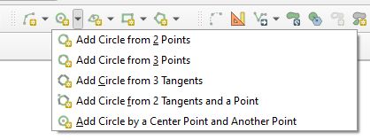

Чтобы превратить окружность в дугу, нужно взять инструмент разрезания 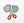 и нарисовать линию реза (закончить рисовку линии реза можно через нажатие правой кнопки мыши). Выберите объекты, которые хотите удалить, с помощью инструмента выделения  и нажмите **DELETE**.

### Настройка символики и подписей {#practice-theod-symbology}
[В начало справки ⇡](#practice-theod)

На схеме теодолитного хода следует различать точки самого хода и твёрдые точки, которые служат твёрдым направлением. Разная символика обуславливается разными значениями атрибутов данного класса в базе данных. Открыть атрибутивную таблицу слоя можно, нажав правой кнопкой мыши по нему и выбрав пункт **Open Attribute Table**.

Для редактирования атрибутов необходимо зайти в режим редактирования с помощью кнопки . Для добавления или удаления атрибутивных столбцов также необходимо зайтив в режим редактирования, после чего появятся соответствующие кнопки 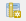 и . Для того чтобы закодировать отличия точек хода и твердых точек, нужно создать новое атрибутивное поле и записать соответствующим точкам разные значения. Обратите внимание, что каждая строка в атрибутивной таблице – это, по сути, один объект в классе объектов. Выделять объекты в атрибутивной таблицы можно с помощью нажатия левой кнопки мыши по левому краю строки. Для выбора нескольких строк подряд можно «тянуть» выделение левой кнопкой мыши, либо выделить первый и последний объект с зажатым **SHIFT**. Для выбора нескольких отдельных строк зажмите **CTRL**. Выделяемые в атрибутивной таблице объекты будут подсвечиваться жёлтым цветом на карте. Для приближения к выбранному объекту нажмите на кнопку **Pan map to the selected rows** (**Увеличить карту до выделенных строк**) 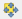.

Для задания символики зайдите в свойства слоя точек, дважды по нему щёлкнув. Перейдите во вкладку **Symbology** (**Стиль**)

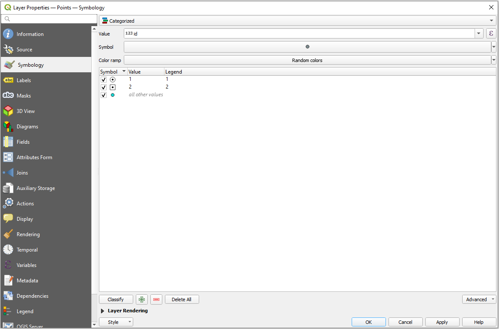

Сверху нужно выбрать способ символики **Categorized**, что позволяет категориально разделить символы по значению атрибута. В поле **Value** нужно указать название атрибута, по котором происходит разделение, после чего нажать на кнопку **Classify** внизу окна – в окне посередине у вас появятся все возможные категории, для каждой из которых можно задать свою символику. Дважды щёлкните по категории, чтобы задать символ.

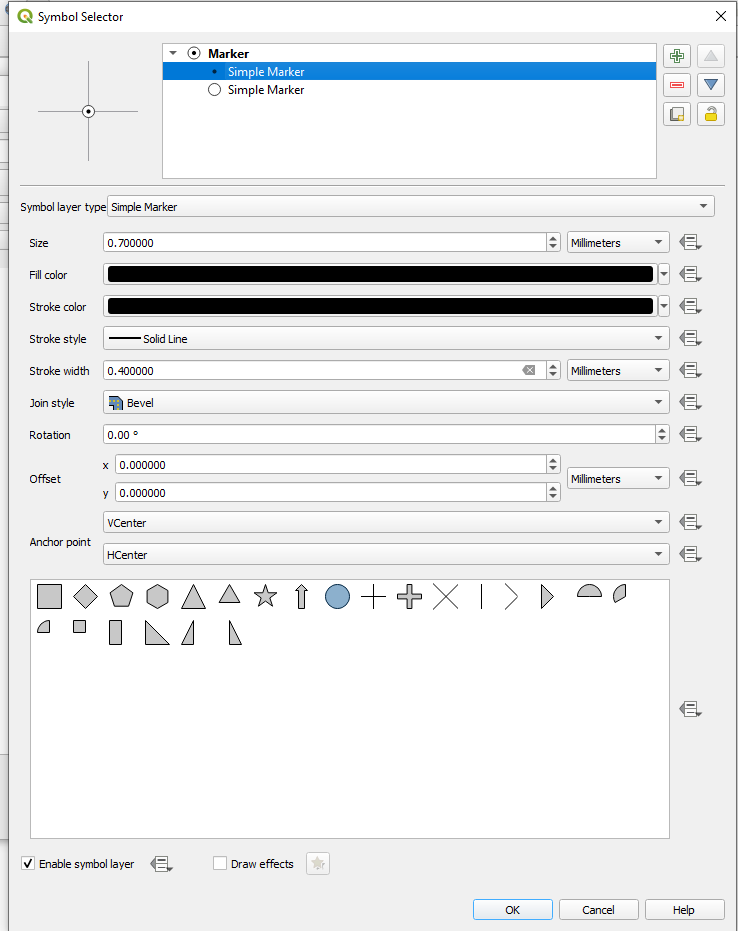

Построение символики в QGIS иерархическое – каждый символ может быть представлен набором слоёв символов. Например, для создания знака временного геодезического пункта (кружок с точкой в центре) вы можете задать два слоя. Верхний слой – точка, которую можно задать кругом чёрного цвета уменьшенного размера. Нижний слой – тот же круг, но уже большего размера с белой заливкой и чёрной обводкой.

Аналогично точкам мы можем разделить по символики стороны хода и твёрдое направление. Для последнего нужно задать два слоя с линией, у которой будет задан параметр **Offset**, то есть сдвиг от оси.

Подписи аналогично символике зависят от значений в атрибутивной колонке. Для включения подписей нужно зайти в свойствах во вкладку **Labels**. Там вы можете включить подписи, выбрав **Single Symbol** и указав атрибутивную колонку, откуда будут браться значения (**Value**), а также гарнитуру, кегль шрифта и прочие настройки форматирования. Во вкладке **Placement** вы можете указать способ размещения подписей относительно объекта.

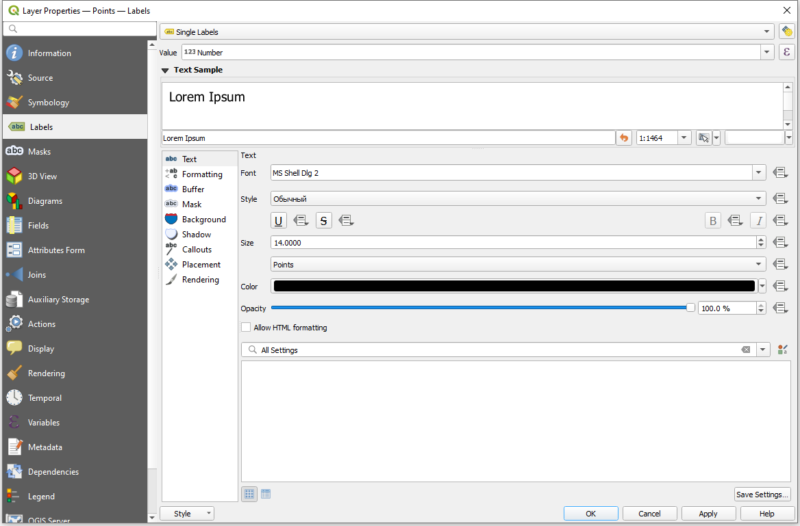

Не забывайте изменять изменения в самом проекте (они касаются набора слоев, их оформления, некоторых параметров) с помощью кнопки .

### Настройка макета компоновки {#practice-theod-layout}
[В начало справки ⇡](#practice-theod)

Для создания макета компоновки схемы теодолитного хода, то есть того, как схема будет выглядеть на листе бумаги, нужно вызвать **Project – Layout Manager**. В открывшемся окне нажмите на кнопку создания макета и задайте имя для него. После этого перед вами появится макет компоновки, который вы можете наполнить необходимыми элементами с помощью специальных кнопок слева.

 
После добавления элементов схемы их перечень появляется в окошке справа вверху. Если выделить элемент, ниже открываются его свойства. Выделите элемент карты, запишите в его свойства масштаб. Систему координат выставить – **WGS 1984 UTM 37N**. В разделе Сетки нажмите на плюсик, чтобы добавить сетку. Выделив сетку и нажав на кнопку **Modify Grid**, мы можем редактировать её отображение.

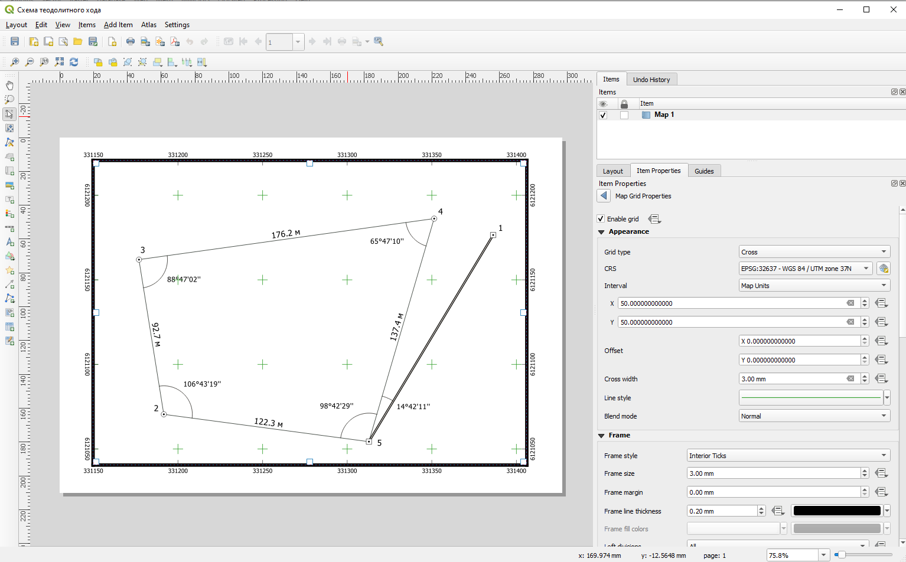

 
В свойствах сетки выберите вид сетки – **Cross** (**перекрестие**), укажите шаг сетки, цвет линии – зеленый. В разделе **Frame** выберите **interior ticks** для показа выходов сетки внутрь рамки. Длину выходов можно установить 3 мм.

В разделе **Draw Coordinates** сориентируйте боковые подписи выходов сетки вертикально вдоль рамки.

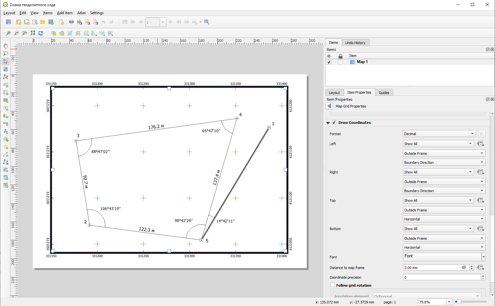

Для настройки рамки создайте ещё одну сетку, нажав на плюс в основных свойствах картографического изображения, затем нажмите на кнопку **Modify Grid** и настройте отображение рамки соответствующим образом.

Для экспорта растрового изображения выберите **Layout – Export as …**.

## Создание схемы нивелирного хода
[В начало справки ⇡](#practice)

### Шаблон схемы нивелирного хода {#practice-level-template}

[Схема нивелирного хода в формате PDF](https://disk.yandex.ru/i/vxkXew-pAmtdRg){target="_blank"}

[Проект шаблона схемы нивелирного хода для QGIS](https://disk.yandex.ru/d/frDDrler8BldDQ){target="_blank"}

### Работа с базой данных {#practice-level-DB}

Для схемы нивелирного хода следует создать отдельную базу данных, в которой будет два класса объектов:

●	Стороны хода;

●	Точки хода.

Как создавать базу данных, можно посмотреть в разделе про [теодолитный ход](#practice-theod-DB).

### Настройка символики и подписей {#practice-level-symbology}
[В начало справки ⇡](#practice-level)

Аналогично тому, как это делалось для теодолитного хода, вы можете оформить объекты на схеме нивелирного хода. Помните о том, что на схеме следует использовать разные символы для твёрдых точек, собственно точек хода и иксовых (дополнительных) точек. Аналогично следует различать собственно стороны хода и стороны хода, примыкающие к иксовым точкам.

Для того чтобы показать направление измерений для сторон нужно установить стрелку. Это можно сделать, зайдя в настройки символики слоя и добавив слой маркеров. В качестве маркера выбирается соответствующий символ стрелки, настраивается его размер и указывается его положение в центральной точке линии.

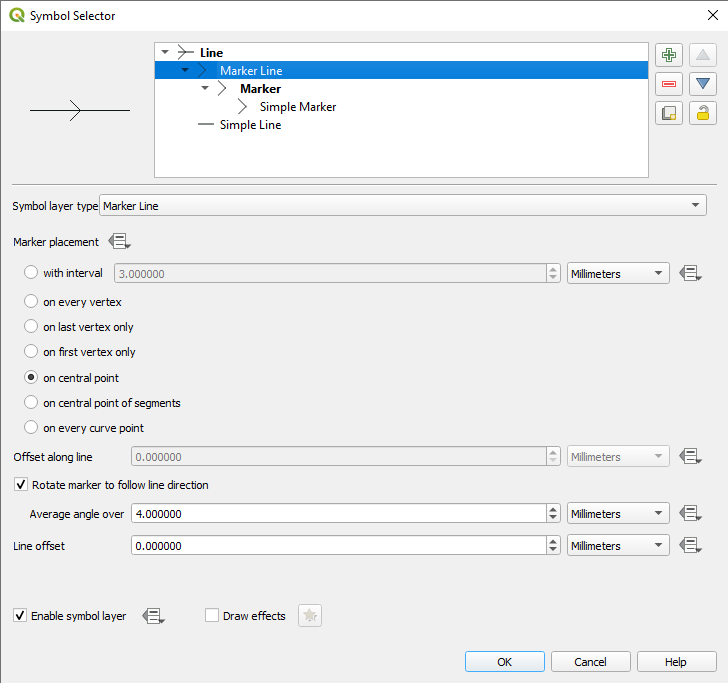

В схеме нивелирного хода можно использовать некоторые возможности оформления подписей в дополнение к описанным в [разделе](#practice-theod-symbology).

1) Показ знака «+» перед положительными значениями превышений. Для этого разделе форматирования в свойствах подписей нужно включить соответствующую опцию и указать поле, по которому будет присваиваться символ.

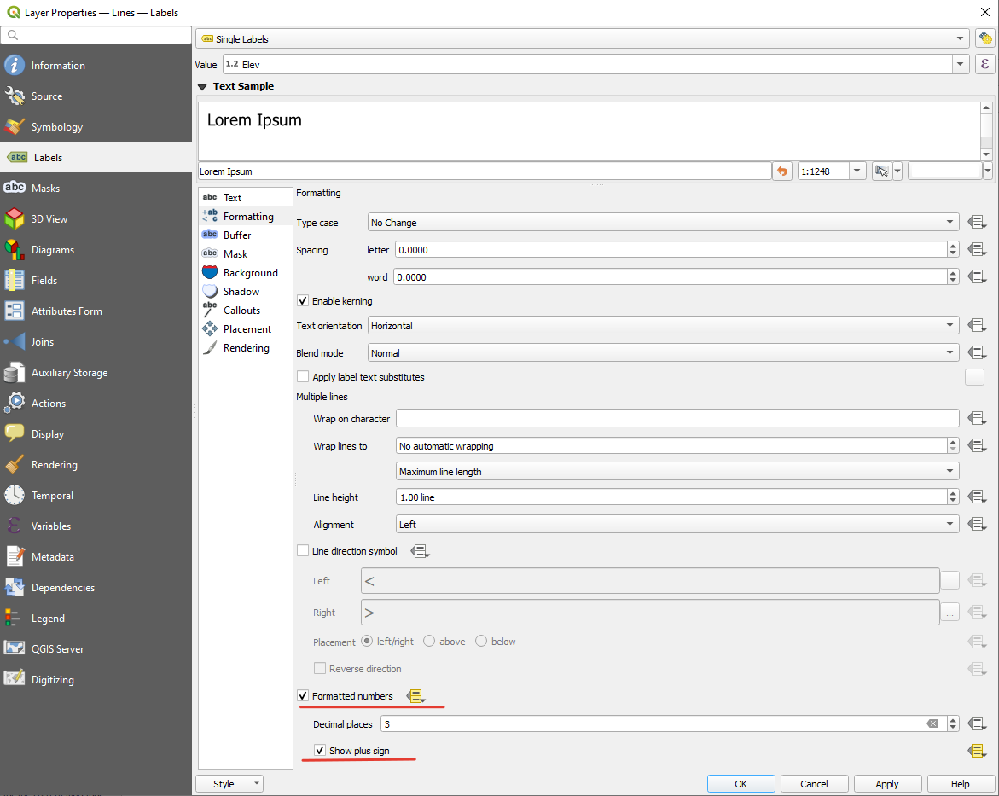

2) Добавление двух подписей к одному объекту: название точки и её высота. Для этого необходимо в свойствах подписей выбрать **Rule-based labeling** в самом верху окна. Добавьте два правила и для каждого задайте свой атрибут в качестве источника подписей. В разделе **Placement** вы можете задать разное относительное размещение подписей, а также задать сдвиг (**offset**) для подписей.

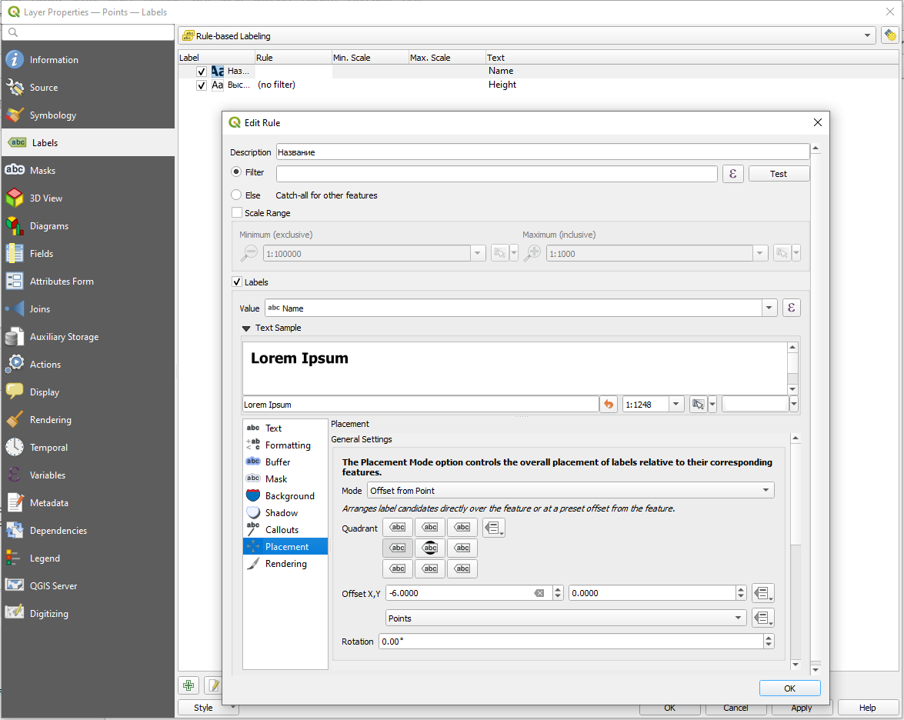

### Настройка макета компоновки {#practice-level-layout}
[В начало справки ⇡](#practice-level)

Настройте макет компоновки аналогично тому, как это описано в разделе про [теодолитный ход](#practice-theod-layout) и экспортируйте результат в PDF.

## Создание топографического плана {#practice-topo}
[В начало справки ⇡](#practice)

### Подгрузка пикетов тахеометрической съёмки {#practice-topo-csv-table-reading}
[В начало справки ⇡](#practice-topo)

QGIS может читать данные в разном формате: векторном, растровом, табличном и других.

Подготовьте таблицу формата CSV, где будут содержаться данные по каждому пикету тахеометрии. Все инструменты для чтения различных форматов данных стандартно расположены на панели слева. Для чтения CSV-таблицы используйте иконку в виде запятой.

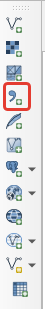

> Примечание: Если у вас такой панели не оказалось, это значит, что она отключена. Для включения панели щелкните правой кнопкой мыши по пустому месту на панели и найдите **Manage Layers Toolbar**.

В открывшемся окне **Data Source Manager | Delimited Text** укажите путь к CSV-файлу. В разделе Формат файла выберите или пропишите разделитель колонок в файле. Если разделитель указан верно, внизу в окошке предпросмотра (**Sample Data**) вы увидите данные ячеек, разнесенные по соответствующим колонкам. При необходимости, если в текстовых полях вы видите непонятные символы, поменяйте кодировку (обычно это либо UTF-8, либо windows-1251). 

В разделе **Geometry Definition** мы указываем поле с геометрией объекта. Если файл CSV содержит координаты X и Y точек, то необходимо выбрать их соответствующее название из выпадающего списка напротив **X field** и **Y field**. Обращаем ваше внимание на то, что в QGIS, как и во всех ГИС-пакетах, реализована правая декартова система координат, то есть x (easting) – направлен на восток, y (northing) направлен на север. Ваши исходные данные могут быть с по-иному заданными осями.

В окошке **Geometry CRS** (**Система координат геометрии**) необходимо указать правильную систему координат, в которую изначально подразумеваются ваши исходные данные. Если неправильно задать систему координат, объекты окажутся не в том месте, где хотелось бы их видеть.
После того, как были заданы все необходимые параметры, должна активироваться кнопка **Add** (**Добавить**) внизу окна. Если она не активирована, вероятно, есть ошибка при чтении данных, например, в исходной таблице неправильно указан десятичный разделитель (точка или запятая в зависимости от настроек операционной системы).

В окне карты должны появиться точечные объекты. Для удобства работы с сними можно добавить подписи этих точек. Для этого нужно зайти в свойства слоя (дважды щёлкнуть по слою), найти пункт **Labels** и выбрать **Single labels**. В окне **Value** выбирается имя поля атрибутивной таблицы, по которому мы хотим получить подписи. Если вы хотите сделать сложную подпись на основе нескольких строк, нажмите на кнопку , откроется конструктор выражений. В среднем окне можно найти пункт Поля и значения. Двойной щелчок по имени поля добавляет его в выражение. Соединение значений полей осуществляется посредством конкатенации строк. Для этого используется символ 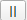. Например, если мы хотим вывести подпись по коду точки и по ее описанию, это может выглядеть так:
_“Code” || “ ” “Description”_

**Сохраните проект.**

### Создание базы данных для топографического плана {#practice-topo-database}
[В начало справки ⇡](#practice-topo)

QGIS поддерживает различные форматы пространственных данных. Среди них наиболее удобным для хранения и работы считается формат **Geopackage**. По сути это формат базы пространственных данных, внутри которой мы можем складывать различные классы объектов.

> Под классом объектов подразумевается набор объектов одного типа геометрии со схожей семантической (смысловой) нагрузкой. Очень важно, чтобы в пределах одного класса объектов не было пересечений объектов. Например, полигоны луговой и высокотравной растительности могут быть отнесены к одному классу объектов, а полигональные объекты гидрографии к другому.

Для создания базы данных формата **Geopackage** откройте окно Браузера внутри QGIS. Если его нет, включите его в выпадающем списке при щелчке правой кнопкой мыши по пустой панели. Найдите каталог, в котором вы хотите создать базу данных (лучше всего, чтобы путь к этой базы состоял из символов латинского алфавита, не содержал дефисов, пробелов и спецсимволов). Правой кнопкой мыши щелкните по каталогу, выберете **New – Geopackage**. Откроется окно, которое помимо самой базы данных предложит создать слой внутри неё. В поле Имя таблицы введите имя класса объектов латинскими символами, лучше, чтобы это был английский перевод соответствующего вида картографируемого объекта, а не транслитерация.

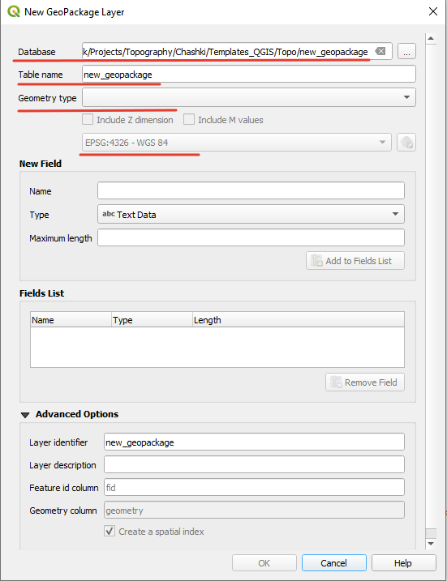

В поле **Geometry type** укажите соответствующую геометрию объектов (тип локализации на плане): точки, линии или полигоны. Обратите внимание, что каждый класс объектов поддерживает только один тип геометрии. Укажите спроецированную систему координат. Если указать геодезическую систему координат, например *WGS 1984*, то велика вероятность, что при векторизации объектов возникнут курьёзные ситуации.
В разделе **New Field** можно указать имя, типа и длину атрибутивного поля создаваемого класса объектов.

Поскольку мы создаем план не небольшую территорию, позволительно будет создать для каждого вида объекта отдельный класс внутри базы. Каждый последующий класс объектов создавайте внутри базы данных. Таким образом вы сформируете единое хранилище для всех картографируемых объектов.

### Векторизация {#practice-topo-vectorization}
[В начало справки ⇡](#practice-topo)

Созданные классы объектов в базе данных можно добавить в перечень слоев проекта простым перетаскиванием. Для редактирования объектов и добавления новых объектов в класс необходимо войти в режим редактирования. Для этого можно щелкнуть правой кнопкой мыши по слою и выбрать пункт **Toggle Editing**, либо выделить слой и найти на панели инструментов кнопку . Активация режима редактирования откроет некоторые другие кнопки на панелях. Например, для полигонального объекта появится кнопка , с помощью которой можно создать новый полигон в слое. Для других типов геометрии иконка будет немного отличаться.

Рисовка контура осуществляется с помощью левой кнопки мыши. Для завершения объекта нажмите правую кнопку мыши. Для редактирования отдельных вершин нажмите на кнопку . После этого у объекта кружочками выделятся вершины.

Курсор в таком режиме может вести себя тремя разными способами:

1)	При выделении вершины вы можете изменить её положение;

2)	При выделении ребра вы можете сдвинуть его вместе со смежными вершинами;

3)	При нажатии на плюсик в центре ребра добавляется новая вершина.

Нажатие на клавишу **delete** позволяет удалить вершину. При векторизации объектов часто возникает необходимость пристыковать вершины одного объекта к вершинам другого объекта. Для корректной и комфортной пристыковки нужно включить панель Инструменты прилипания (**snapping**). Кнопка в виде магнита  активирует прилипание. Остальные кнопки на данной панели позволяют уточнить параметры прилипания, в том числе расстояние, на котором оно начинает действовать.

Если вам необходимо повторить значительную часть существующего контура при создании нового, то удобнее всего воспользоваться трассировкой (**Tracing**), нажав на кнопку 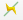 на панели инструментов прилипания. После этого при ведении на небольшом расстоянии от контура новый контур будет автоматически пристыковываться к существующем.

_Advanced Digitizing Toolbar_

Соответствующую панель вы так же, как и предыдущую, можете найти в выпадающем списке панелей.

На данной панели доступны инструменты для для перемещения объектов 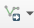, создания внутренних колец (по сути – вырезание дырки в полигоне) 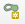, разрезания объектов , склеивания объектов 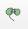, изменения направления линии 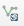 и другие.

Выбрать объекты, например, для склеивания можно с помощью инструмента выделения .

Не забывайте регулярно сохранять изменения в геометрии слоев с помощью кнопки на панели . Также не забывайте изменять изменения в самом проекте (они касаются набора слоев, их оформления, некоторых параметров) с помощью кнопки .

### Оформление в условных знаках {#practice-topo-symbols}
[В начало справки ⇡](#practice-topo)

Для работы с оформлением топографического плана скачайте [символы](https://yadi.sk/d/mb1wTvAUUAgVUQ){target="_blank"} и [топографические шрифты](https://yadi.sk/d/G_3EVFLqg3C5pA){target="_blank"}, а также [условные обозначения 2005 года](https://yadi.sk/i/4EpTOHEhQdVq9g){target="_blank"} и [условные обозначения 1989 года](https://disk.yandex.ru/i/_WJi-PJUXlZi3Q){target="_blank"}.

Переместите папку со скаченными символами в удобную для использования директорию. Затем в основном меню QGIS выберите **Settings – Options...**. В открывшемся окне глобальных настроек перейдите во вкладку **System** и выберите раздел **SVG Paths**. Нажмите на плюс и добавьте путь к набору векторных символов.

Для оформления слоёв проекта в условных знаках необходимо дважды щёлкнуть по слою. Откроются его свойства, среди которых в данный момент нас интересует **Symbology**. Для точечного слоя по умолчанию будет выставлен **Marker – Simple Marker**.

С ним особо ничего не сделаешь – можно поменять геометрическую фигуру, изменить размер или цвет. Для использования более разнообразной библиотеки символов нужно в типе слоя выбрать **SVG Marker**.

При выборе символа внизу появляется адрес к данному символу у вас на компьютере. Размер символа и его цвет вы можете настраивать в этом же окне.

Для площадных объектов всё работает похоже, но немного сложнее. По умолчанию для таких слоёв даётся заливка цветом, которую можно менять. Дополнительно можно менять обводку. Для того чтобы заполнить наши площадные объекты штриховкой из специальных символов, например, газона или луговой растительности, нужно выбрать заливку маркерами **Fill – Point Pattern Fill – Marker**. Простой маркер замените на **SVG Marker** и укажите соответствующий символ из скаченной библиотеки. Задайте размеры символа согласно условным знакам. Имейте в виду, что по умолчанию ширина и высота символа меняются пропорционально, но если нажать на замок справа, то вы сможете произвольно масштабировать символ.

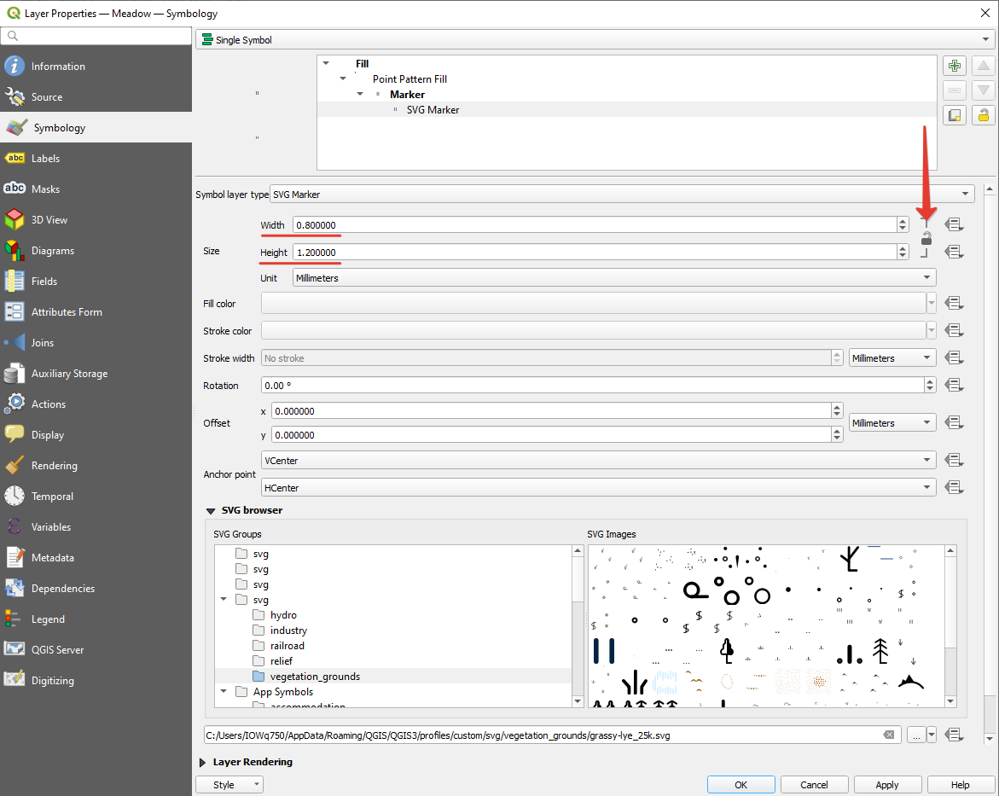

Для настройки шага (частоты) маркеров необходимо выделить **Point Pattern Fill** в иерархии структуры стиля. Введите значения вертикального и горизонтального расстояния согласно принятым условным обозначениям. Обратите внимание, что вы можете указать единицы измерения в миллиметрах. Для того чтобы выставить маркеры в шахматном порядке можно задать параметр **Displacement** по горизонтали или по вертикали.

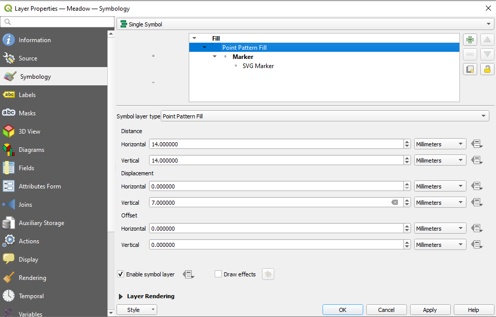

Для получения случайного заполнения маркерами используйте соответствующую опцию **Random Marker Fill**. Например, для обозначения леса можно использовать простой маркер в виде круга с белой заливкой и чёрной обводкой. Укажите способ расчёта (**Count Method**) через плотность. Параметр **Seed** - это стартовое число для генерирования случайных последовательностей.

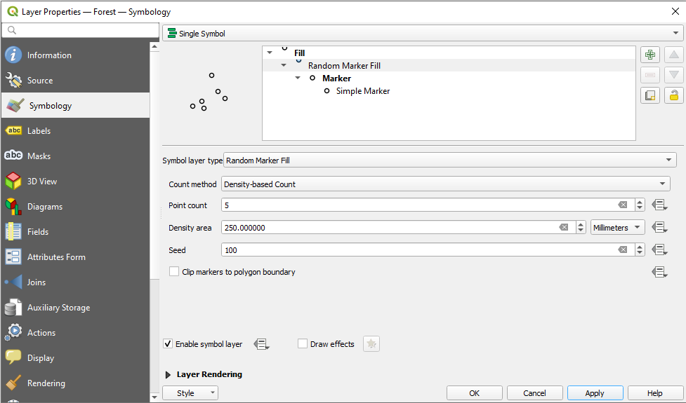

**Детальные настройки символов сверяйте с Условными обозначениями, проверяйте, как они выглядят в режиме макета.**

### Автоматизация создания некоторых объектов на топографических планах {#practice-topo-tips_tricks}
[В начало справки ⇡](#practice-topo)

#### Создание площадного объекта дороги {#practice-topo-tips_tricks-roads}

Обычно дороги при топографической съёмке отбиваются по осевой линии, если у них известная и постоянная ширина. Чтобы наиболее эффективно и быстро построить площадной знак дороги по таким исходным данным, можно воспользоваться одним из инструментов геообработки QGIS, который строит буферные зоны. Для этого щёлкните правой кнопкой мыши по пустому полю верхней панели программы, чтобы увидеть список окон и панелей. Выберите панель **Processing Toolbox Panel**. Это панель со всеми инструментами геообработки. Через поисковую строку панели найдите инструмент **Buffer**. Дважды щёлкните по инструменту, после чего откроется окно.

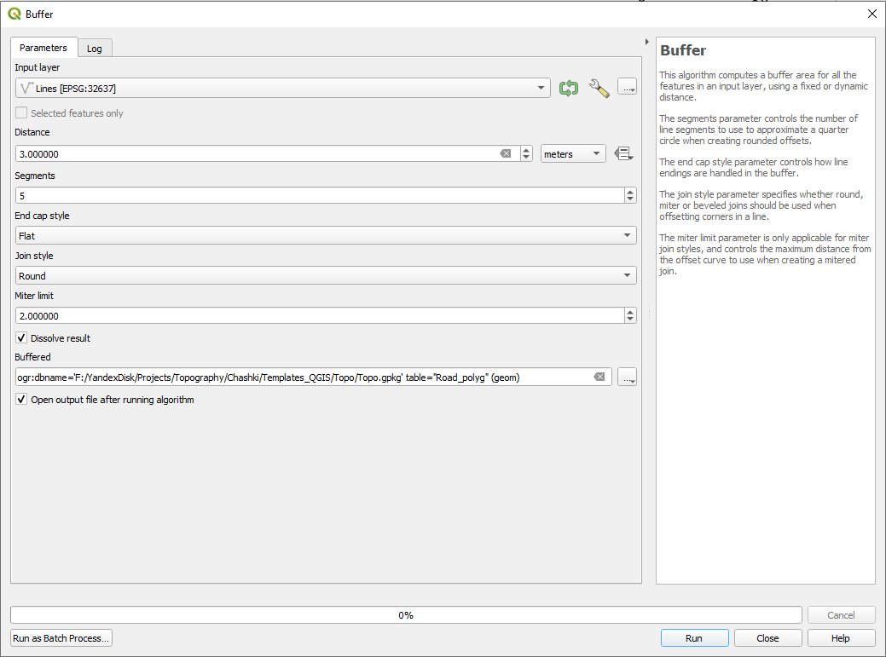

В окне необходимо задать параметры: входной линейный класс объектов, т. е. ось дороги; **Distance** – радиус буферной зоны, определяющий половину ширины дороги; параметр **End Cap Style** позволяет установить стиль окончания буфера; галочка **Dissolve Result** позволяет склеить несколько буферных зон в один объект. В параметр **Buffered** вводится выходной класс объектов. Чтобы выходной класс был не временным, а постоянным, выберите справа опцию **Save to Geopackage**, укажите путь к вашей базе данных, после чего откроется маленькое окно, куда предлагается ввести название выходного класса.

Условный знак просёлочных и полевых дорог в масштабе 1:500 представляет собой полигон с двумя разными стилями обводки – сплошной и штриховой. Проще всего такой условный знак построить, конвертировав полигон в линии с помощью инструмента **Polygons to lines**. Найдите его через поиск в панели инструментов геообработки.

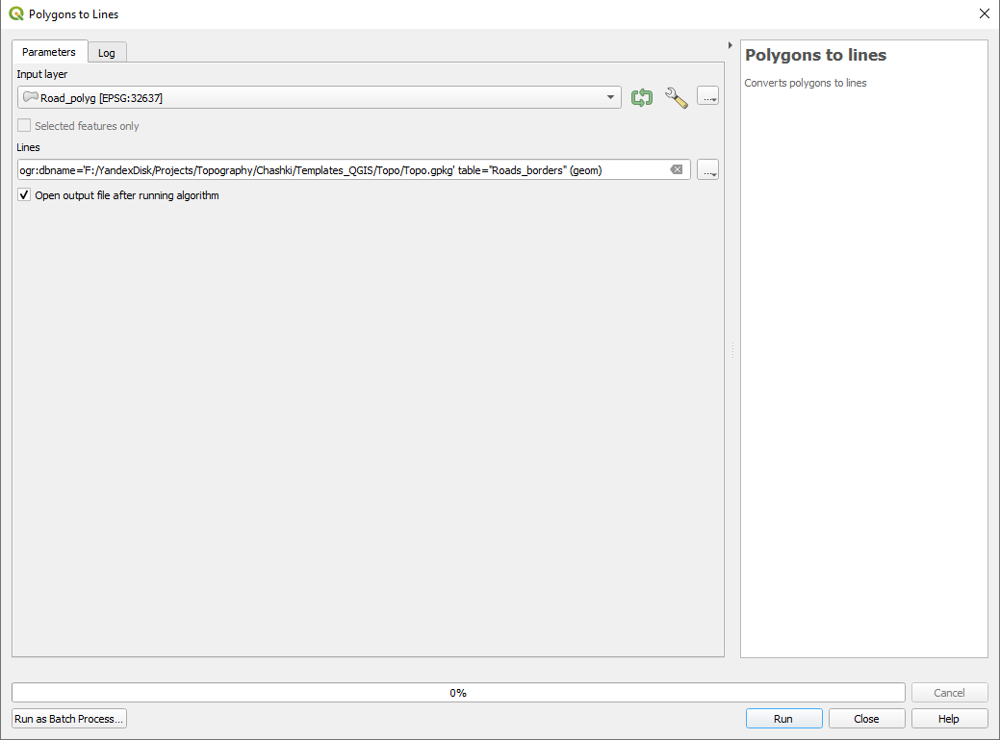

Сохраните выходной линейный класс объектов в базе данных, отредактируйте его геометрию (порежьте на сегменты, удалите лишние сегменты) и присвойте линиям разную символику в зависимости от значения атрибута. Для этого зайдите в свойства символики слоя и выберите способ символики **Categorized**, после чего нажмите на кнопку **Classify**, и у вас появтся разные стили линий, в зависимости от значения атрибута. Для штриховой линии в настройках символа **Simple Line** включите галочку **Use custom dash pattern**. Здесь вы можете задать длину штриха и длину пробела согласно принятым условным обозначениям

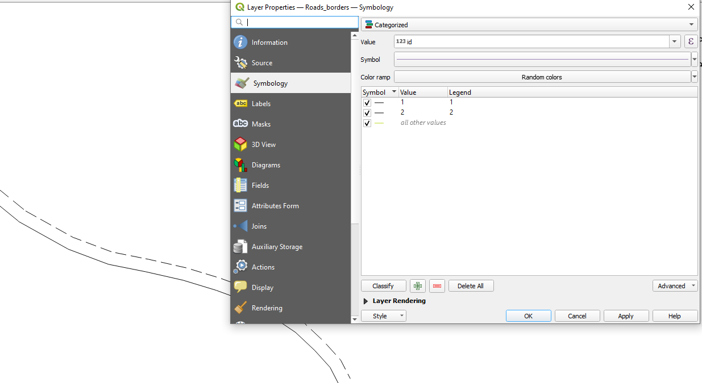

#### Создание объекта границы растительности {#practice-topo-tips_tricks-vegetation-borders}
[В начало справки ⇡](#practice-topo)

Границы растительности и грунтов обозначаются пунктирной линией, но если настраивать стандартным образом обводку у полигонов соответствующих объектов, то при стыковке двух полигонов произойдёт наложение границ. Именно поэтому границы должны существовать в виде отдельного класса объекта. Для этого можно воспользоваться инструментом **Polygons to lines** и удалив дублирующие сегменты.

### Обработка высотных данных {#practice-topo-elevation}
[В начало справки ⇡](#practice-topo)

При построении топографического плана горизонтали можно проводить вручную, а можно попробовать получить их автоматически на основе цифровой модели рельефа. В рамках учебной практики вы попробуете оба варианта и оцените достоверность и точность каждого.

> Цифровая модель рельефа (Digital Elevation Model) – это растр, каждый пиксель которого кодирует высоту.

Для построения ЦМР в QGIS на основе данных тахеометрической съёмки можно использовать инструмент ГИС-пакета SAGA, который доступен через интерфейс QGIS. Для этого в панели **Processing Toolbox Panel** через поисковую строку найдите инструмент **Natural neighbour**. Это инструмент линейной интерполяции точечных данных на основе триангуляции. Среди параметров инструмента важно указать разрешение итоговой модели.

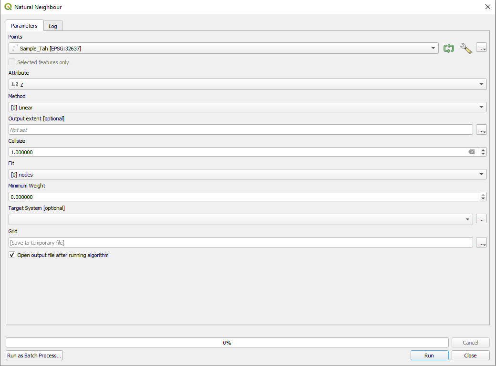

Для извлечения из ЦМР горизонталей следует воспользоваться другим инструментом – **Contour** – его так же можно найти через поиск.

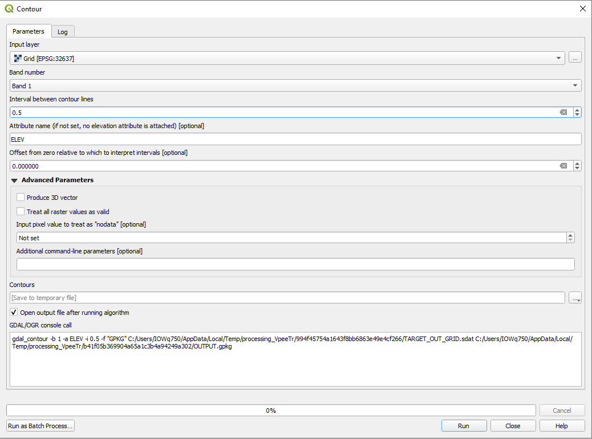

Самый важный параметр, который следует указать в интерфейсе этого инструмента – сечение горизонталей (**Interval between contour lines**).

Для настройки подписей горизонталей зайдите в свойства слоя во вкладку **Labels**.

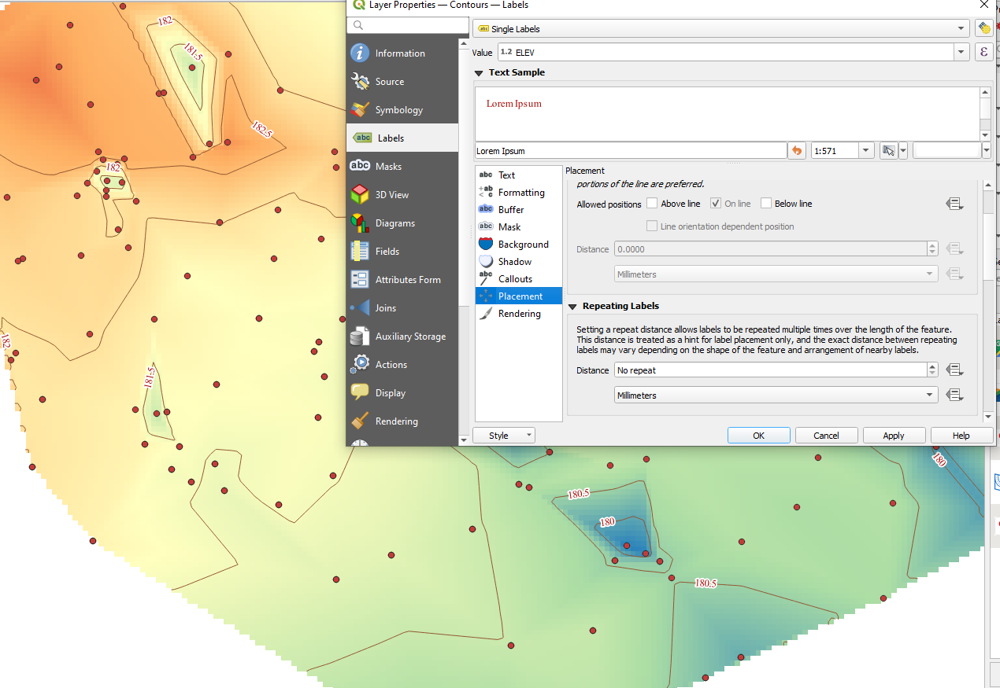

В разделе **Text** можно указать гарнитуру, кегль. В разделе **Buffer** можно включить т.н. гало, т. е. обводку вокруг символов, которая закрывает собой горизонтали. В разделе **Placement** в свойстве **Mode** указывается **Curved**, т. е. подпись по кривой, а также включается размещение **on line**, чтобы подпись лежала на горизонтали.

### Оформление макета {#practice-topo-layout}
[В начало справки ⇡](#practice-topo)

[Пример оформления макета топографического плана](https://disk.yandex.ru/d/rWXOQug9ts11fQ){target="_blank"}

С основами создания и оформления макета компоновки можно ознакомиться в разделе по [теодолитному ходу](#practice-theod-layout). Вы можете скачать шаблон оформления макета топографического плана и поменять его экстент в соответствии со своей территорией (по ссылке выше скачайте файл с расширением *.qpt). 

Загрузить шаблон оформления макета можно, вызвав через меню менеджер макетов (**Project – Layout Manager**). В открывшемся окне выберите создание макета на основе конкретного шаблона (**Specific**). Задайте путь к файлу QPT. Нажмите на кнопку **Create**.

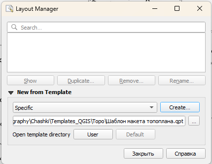

Чтобы поменять охват территории, зайдите в свойства элемента карты и поменяйте значения координат экстента (охвата) под свою территорию, введя максимальные, а затем минимальные координаты по обеим осям.

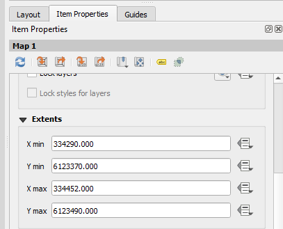

> Обратите внимание, что в зависимости от предыдущих значений координат экстента, у вас может не с первого раза получиться ввести свои координаты, поэтому введите их повторно.

Изменить размер листа можно щелчком правой кнопкой мыши по листу. После этого справа откроются свойства элемента, где можно указать размеры листа.

Рамка топографической карты состоит из внутренней тонкой и внешней толстой рамки. Обе рамки можно по отдельности добавить в свойствах элемента.

Для того чтобы сделать подписи координат приближенными к стандартным в настройках, нужно зайти в свойства сетки. Сделаем, например, так, что последние три цифры координат будут подписываться всегда, остальные же только на крайних на листе выходах сетки. Выберем для подписи последних трёх цифр внутренню рамку, зайдём в раздел **Draw Coordinates** и в пункте **Format** укажем **Custom**. После нажатия на кнопку выражения, перед вами откроется окно, где нужно написать выражение *right(to_string(\@grid_number), 3)*.

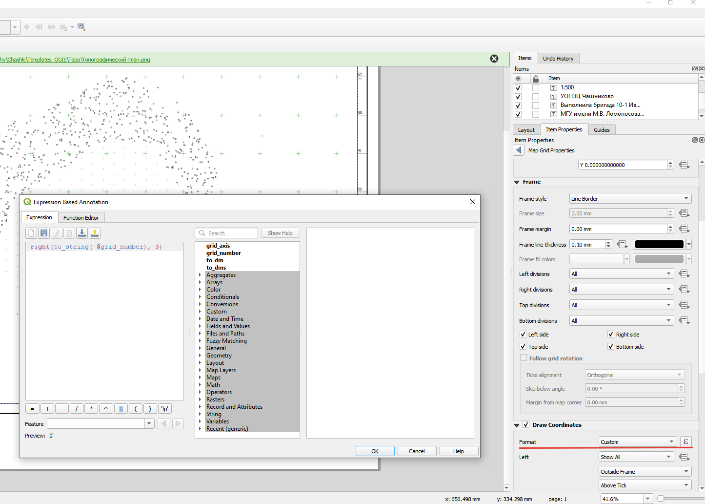

Для того чтобы сделать подписи первых частей координат у крайних выходов сетки, нужно зайти в настройки внешней рамки и по аналогии с предыдущим указать пользовательский формат подписи. В окне выражения нужно написать *left(to_string(\@grid_number), length(to_string(\@grid_number)) - 3)*. Чтобы подписывались только крайние выходы сетки, нужно в разделе **Appearance** задать свойства **Interval**, исходя из охвата вашей карты, и свойства **Offset**, исходя из значений координат крайней левой и крайней нижней линии сетки.

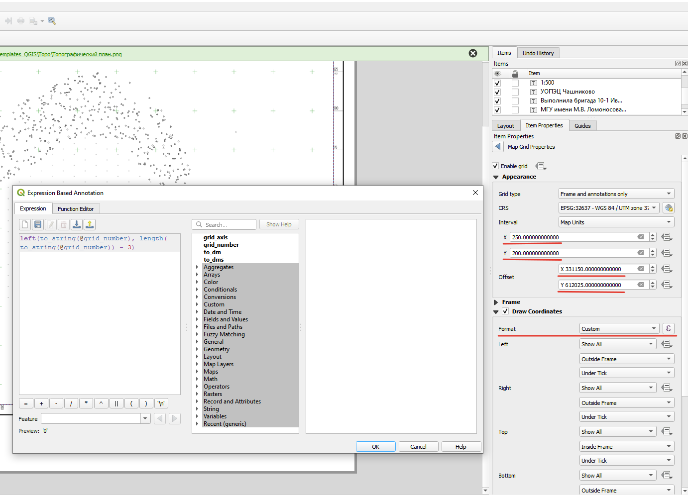

Обратите внимание, что согласно условным обозначениям у всех текстовых элементов есть определённые шрифты, которые вы можете установить и задать для вашей карты.

## Привязка и дешифрирование космического снимка {#practice-georeference}
[В начало справки ⇡](#practice)

### Исходные данные {#practice-georeference-data}

[Снимок Keyhole 1973 года для привязки по наземным опорным точкам](https://disk.yandex.ru/i/7a93zQEgNnI4dA){target="_blank"}

Снимки для дешифрирования

[Снимок Digital Globe 2018 года. Участок 1](https://disk.yandex.ru/i/bIn38XOCT92FXA){target="_blank"}

[Снимок Digital Globe 2018 года. Участок 2](https://disk.yandex.ru/i/_VykXwJloU-0yA){target="_blank"}

[Снимок Digital Globe 2018 года. Участок 3](https://disk.yandex.ru/i/D0-eTUvb3eX_1w){target="_blank"}

### Сброс данных со спутниковых навигаторов {#practice-georeference-gpx}

Для сброса данных со спутниковых навигаторов подключите их через интерфейс mini usb к компьютеру. Откроется окно проводника **Garmin**. Зайдите в папку **GPX** и скопируйте путевые точки. Из папки **Current** скопируйте текущий трек.

### Привязка по наземным опорным точкам {#practice-georeference-gcp}

Добавьте снимок в проект, нажав на кнопку 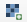. Поскольку добавленный снимок на данный момент не привязан, справа от слоя в таблице слоёв вы увидите знак вопроса.

> Если вы не видите снимок, то, вероятно, он расположился где-то за пределами вашего экрана. Чтобы увидеть его, нажмите правой кнопкой мыши по слою и выберете **Zoom to Layer** (**Увеличить до слоя**). Обратите внимание на значения координат и масштаб внизу окна. Что они могут означать?

Запустите модуль привязки через меню **Layer – Georeferencer** (**Слои – Привязка растров...**).

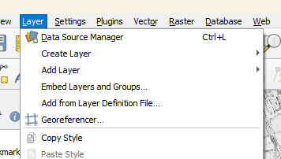

> Если вы не видите такого пункта меню, то зайдите в **Plugins – Manage and Install plugins...** (**Установки – Модули и управление модулями**), найдите через поиск и включите соответствующий модуль, поставив галочку (с версии 3.16 этот модуль по умолчанию встроен в QGIS).

Откроется отдельное окно привязки. Нажмите на кнопку **Открыть растр** , добавьте привязываемый растр. Щелчок левой кнопкой мыши по привязываемому изображению в месте потенциального размещения опорной точки откроет окно, куда будет предложено ввести координаты. При использовании наземных опорных точек, отмеченных в ходе маршрута на навигации, введите координату **X** в окно **Easting** и **Y** в окно **Northing**.

> При работе на полигоне Чашниково координаты СК проекции WGS 1984 UTM 37N **Northing** начинаются с цифр *621*, координаты **Easting** с *38*.

Если в вашей версии QGIS в открывшемся окне есть опция выбора системы координат, укажите **правильную**.

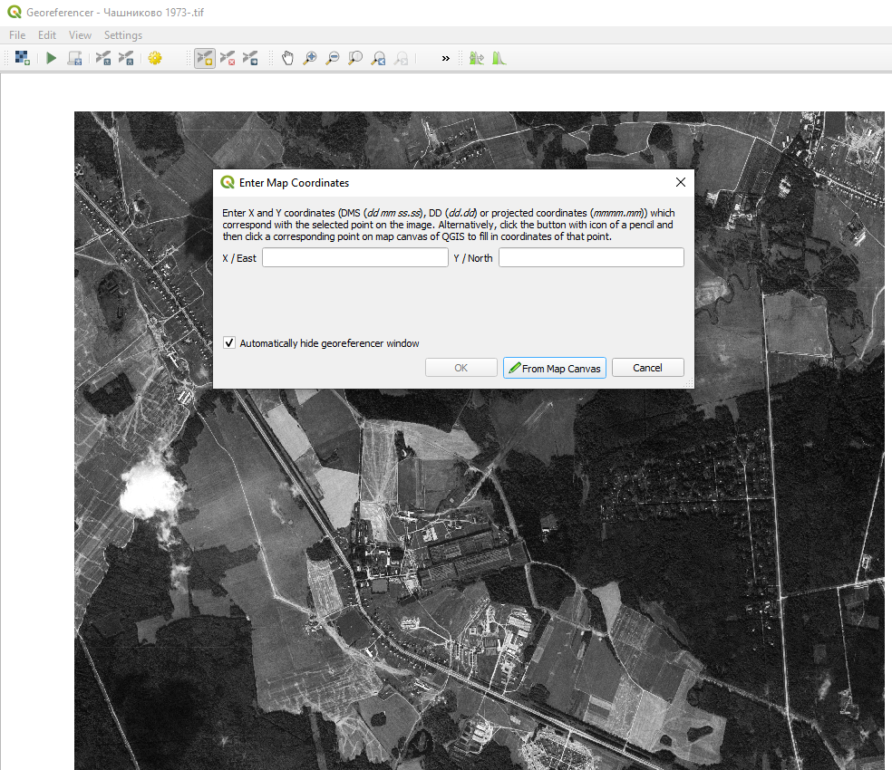

> Обратите внимание, что оси X и Y в геоинформационном программном обеспечении ориентированы как в математике. Для координаты X вводить номер зоны **не нужно**.

После расстановки точек внизу окна появится таблица с вашими точками привязки – будут указаны координаты этих точек в исходной СК изображения и в целевой СК, а также невязки. Далее необходимо указать способ трансформации для расчёта невязок. Нажмите на кнопку 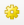. В качестве типа трансформации для снимка может подойти полиномиальное преобразование первой степени (минимально необходимо 3 опорные точки) или проективное преобразование (минимально необходимо 4 опорные точки). Укажите целевую систему координат (в которой вводились координаты точек), а также путь для сохраняемого файла.

Убедитесь в том, что стоит галка напротив опции **Use 0 for transparency when needed**, чтоб у вас не было чёрной рамки вокруг привязанного растра.

> Сохраняйте файлы в папку с путями без латиницы, пробелов и спецсимволов.

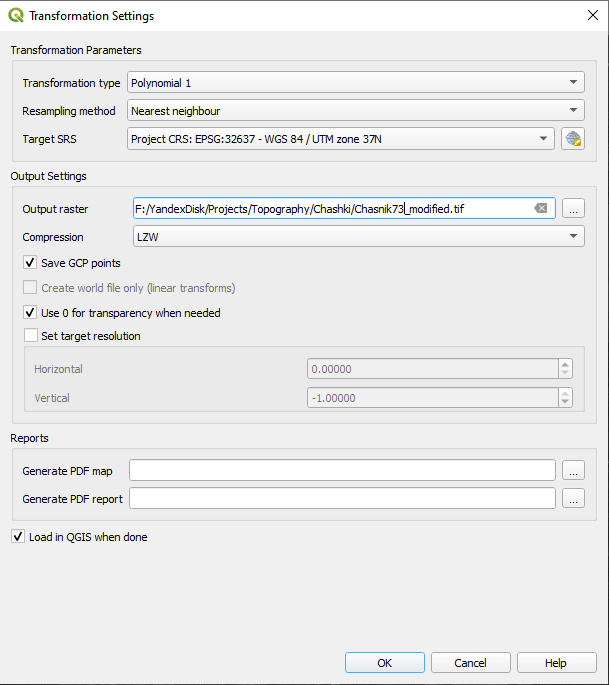

После добавления трансформированного изображения в основное окно карты убедитесь в правильности проделанной операции, сравнивая его с подложкой из мозаики спутниковых снимков. Для этого удобно использовать инструмент шторки.

Зайдите в **Модули – Управление и установка модулей...** и вбейте в поиск **MapSwipe Tool**. После этого появится панель шторки.

Выберите слой, который будет активен в режиме шторки (будет находиться под шторкой) и нажмите на кнопку 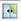.

### Дешифрирование снимка {#practice-georeference-interpretation}

Для дешифрирования космических снимков необходимо осуществить их привязку. В случае с современными космическими снимками это можно сделать на основе подложки картографических веб-сервисов.

Для привязки данных дистанционного зондирования в QGIS можно использовать WMS-сервис с мозаикой спутниковых снимков. Для включения мозаики зайдите в меню **Модули – Управление и установка модулей...**. Впишите в строку поиска __QuickMapServices__. Установите модуль.

Откроется окно модуля. В окне поиска геосервиса введите __Google satelite__ или какой-либо еще картографический веб-сервис со спутниковой подложкой. Нажмите **Добавить**.

Добавьте в качестве слоя данных привязываемый снимок.

> Примечание: Если у вас такой панели не оказалось, это значит, что она отключена. Для включения панели щелкните правой кнопкой мыши по пустому месту на панели и найдите **панель работы со слоями**.

Процесс дешифрирования представляет собой создание базы данных и векторизацию объектов по данным космической съёмки. О том, как это делается, вы можете узнать из раздела 7.3.2 и 7.3.3.

----
_Карпачевский А.М._ **Топография с основами картографии**. М.: Географический факультет МГУ, `r lubridate::year(Sys.Date())`.
----