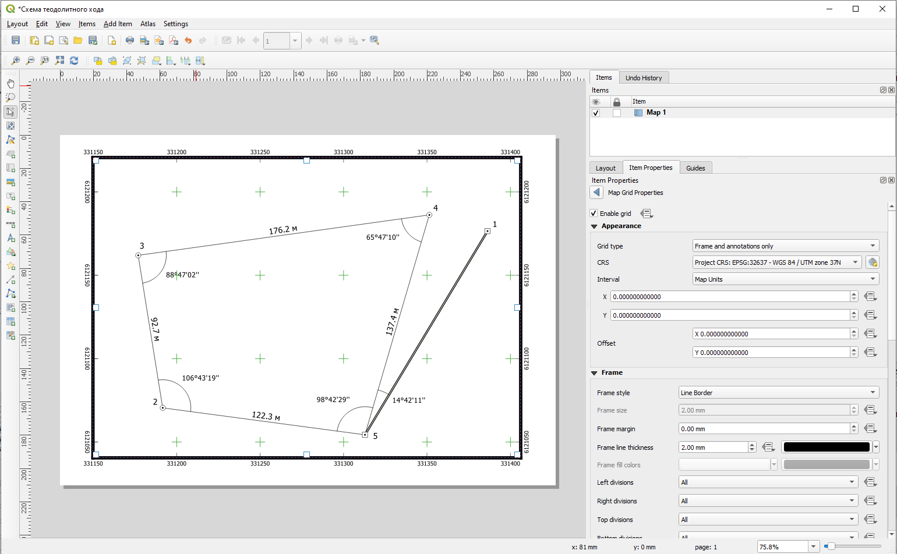
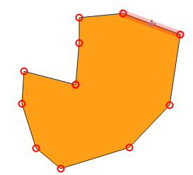
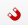
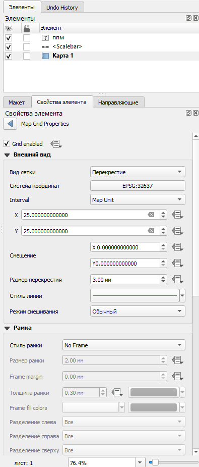
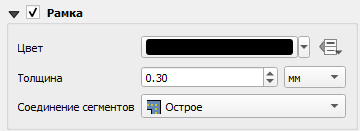
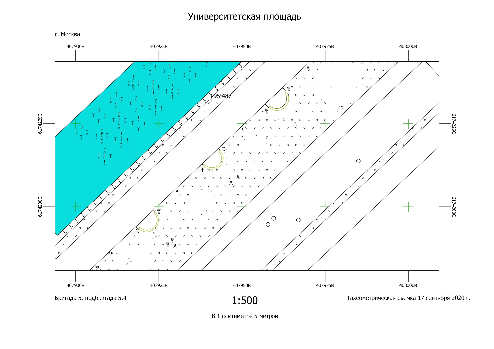

# Использование QGIS во время полевой топографической практики {#practice}

## Создание схемы теодолитного хода {#practice-theod}
[В начало справки ⇡](#practice)

### Шаблон схемы теодолитного хода {#practice-theod-template}

[Схема теодолитного хода в формате PDF](https://disk.yandex.ru/i/Z3H_BOK2KYfDRQ){target="_blank"}

[Проект шаблона схемы теодолитного хода для QGIS](https://disk.yandex.ru/d/JcXRhKuiqoVTLg){target="_blank"}

### Работа с базой данных {#practice-theod-DB}

Для схемы теодолитного хода следует создать отдельную базу данных, в которой будет несколько классов объектов:

●	Стороны хода

●	Дуги внутренних углов хода

●	Точки хода.

Создать базу данных можно, нажав правой кнопкой по выбранной вами директории в браузере (проводнике). Выберите пункт меню **New – Geopackage**.

У вас откроется окно создания базы данных, где вы можете задать имя базы данных, сразу же создать один из классов, указав его тип геометрии и систему координат.

Остальные классы объектов вы можете создать, щелкнув правой кнопкой мыши по уже созданной базе данных и выбрав пункт меню **New Table**

### Черчение хода {#practice-theod-draw}

Для нанесение точек хода необходимо добавить в проект из базы данных точечный класс объектов простым перетаскиванием, либо дважды щёлкнув по ним в Браузере. Для редактирования объектов и добавления новых объектов в класс необходимо войти в режим редактирования. Для этого можно щелкнуть правой кнопкой мыши по слою и выбрать пункт **Режим редактирования** (**Toggle Editing**), либо выделить слой и найти на панели инструментов кнопку . Активация режима редактирования откроет некоторые другие кнопки на панелях. Например, для точечного класса объекта появится кнопка . Нажав на эту кнопку, вы сможете поставить точку в произвольном месте.

Чтобы поставить точки по строго заданным (рассчитанным при уравнивании теодолитного хода) координатам необходимо использовать панель **Advanced Digitizing Panel**. Если она не открыта, щёлкните правой кнопкой мыши по пустому месту сверху основного окна QGIS и в выпадающем списке отметьте панель и окно.

Нажмите на кнопку активации инструментов . Введите координаты *X* и *Y*, закрепляя их замком (или нажатием на **Enter**). Щёлкните левой кнопкой мыши по карте – новая точка установится строго по заданным координатам. Сохраните изменения, нажав на иконку сохранения  на панели редактирования.

Для отрисовки сторон хода нужно зайти в режим редактирования соответствующего слоя. При векторизации объектов часто возникает необходимость пристыковать вершины одного объекта к вершинам другого объекта. Для корректной и комфортной пристыковки нужно включить панель Инструментов прилипания (**snapping**). Кнопка в виде магнита  активирует прилипание. Остальные кнопки на данной панели позволяют уточнить параметры прилипания, в том числе расстояние, на котором оно начинает действовать. Отрисуйте стороны с включенным режимом прилипания, нажимая на левую кнопку мыши для установки вершин и завершая отрисовку правой кнопкой мыши. Сохраните изменения.

> Обратите внимание, что каждая сторона теодолитного хода должна быть отдельным объектом.

Для черчения дуг углов включите панель **Shape Digitizing Toolbar**, нажав на пустое место верхней части окна QGIS правой кнопкой. На этой панели вам потребуется инструмент, который строит окружность по центральной точке и произвольной точки окружности (последний в списке).

Чтобы превратить окружность в дугу, нужно взять инструмент разрезания  и нарисовать линию реза (закончить рисовку линии реза можно через нажатие правой кнопки мыши). Выберите объекты, которые хотите удалить, с помощью инструмента выделения  и нажмите **DELETE**.

### Настройка символики и подписей {#practice-theod-symbology}

На схеме теодолитного хода следует различать точки самого хода и твёрдые точки, которые служат твёрдым направлением. Разная символика обуславливается разными значениями атрибутов данного класса в базе данных. Открыть атрибутивную таблицу слоя можно, нажав правой кнопкой мыши по нему и выбрав пункт **Открыть таблицу атрибутов**.

Для редактирования атрибутов необходимо зайти в режим редактирования с помощью кнопки . Для добавления или удаления атрибутивных столбцов также необходимо зайтив в режим редактирования, после чего появятся соответствующие кнопки  и . Для того чтобы закодировать отличия точек хода и твердых точек, нужно создать новое атрибутивное поле и записать соответствующим точкам разные значения. Обратите внимание, что каждая строка в атрибутивной таблице – это, по сути, один объект в классе объектов. Выделять объекты в атрибутивной таблицы можно с помощью нажатия левой кнопки мыши по левому краю строки. Для выбора нескольких строк подряд можно «тянуть» выделение левой кнопкой мыши, либо выделить первый и последний объект с зажатым **SHIFT**. Для выбора нескольких отдельных строк зажмите **CTRL**. Выделяемые в атрибутивной таблице объекты будут подсвечиваться жёлтым цветом на карте. Для приближения к выбранному объекту нажмите на кнопку **Увеличить карту до выделенных строк**.

Для задания символики зайдите в свойства слоя точек, дважды по нему щёлкнув. Перейдите во вкладку **Symbology** (**Стиль**)

Сверху нужно выбрать способ символики **Categorized**, что позволяет категориально разделить символы по значению атрибута. В поле **Value** нужно указать название атрибута, по котором происходит разделение, после чего нажать на кнопку **Classify** внизу окна – в окне посередине у вас появятся все возможные категории, для каждой из которых можно задать свою символику. Дважды щёлкните по категории, чтобы задать символ.

Построение символики в QGIS иерархическое – каждый символ может быть представлен набором слоёв символов. Например, для создания знака временного геодезического пункта (кружок с точкой в центре) вы можете задать два слоя. Верхний слой – точка, которую можно задать кругом чёрного цвета уменьшенного размера. Нижний слой – тот же круг, но уже большего размера с белой заливкой и чёрной обводкой.

Аналогично точкам мы можем разделить по символики стороны хода и твёрдое направление. Для последнего нужно задать два слоя с линией, у которой будет задан параметр **Offset**, то есть сдвиг от оси.

Подписи аналогично символике зависят от значений в атрибутивной колонке. Для включения подписей нужно зайти в свойствах во вкладку **Labels**. Там вы можете включить подписи, выбрав **Single Symbol** и указав атрибутивную колонку, откуда будут браться значения (**Value**), а также гарнитуру, кегль шрифта и прочие настройки форматирования. Во вкладке **Placement** вы можете указать способ размещения подписей относительно объекта.

Не забывайте изменять изменения в самом проекте (они касаются набора слоев, их оформления, некоторых параметров) с помощью кнопки .

### Настройка макета компоновки {#practice-theod-layout}

Для создания макета компоновки схемы теодолитного хода, то есть того, как схема будет выглядеть на листе бумаги, нужно вызвать **Project – Layout Manager**. В открывшемся окне нажмите на кнопку создания макета и задайте имя для него. После этого перед вами появится макет компоновки, который вы можете наполнить необходимыми элементами с помощью специальных кнопок слева.

 
После добавления элементов схемы их перечень появляется в окошке справа вверху. Если выделить элемент, ниже открываются его свойства. Выделите элемент карты, запишите в его свойства масштаб. Систему координат выставить – **WGS 1984 UTM 37N**. В разделе Сетки нажмите на плюсик, чтобы добавить сетку. Выделив сетку и нажав на кнопку **Modify Grid**, мы можем редактировать её отображение.

 
В свойствах сетки выберите вид сетки – перекрестие, укажите шаг сетки, цвет линии – зеленый. В разделе **Frame** выберите **interior ticks** для показа выходов сетки наружу рамки. Длину выходов установить 3 мм.

В разделе **Draw Coordinates** сориентируйте боковые подписи выходов сетки вертикально вдоль рамки.

Для настройки рамки создайте ещё одну сетку, нажав на плюс в основных свойствах картографического изображения, затем нажмите на кнопку **Modify Grid** и настройте отображение рамки соответствующим образом.

Для экспорта растрового изображения выберите **Layout – Export as …**

## Создание схемы нивелирного хода
[В начало справки ⇡](#practice)

### Шаблон схемы нивелирного хода {#practice-level-template}

[Схема нивелирного хода в формате PDF](https://disk.yandex.ru/i/vxkXew-pAmtdRg){target="_blank"}

[Проект шаблона схемы нивелирного хода для QGIS](https://disk.yandex.ru/d/frDDrler8BldDQ){target="_blank"}

### Работа с базой данных {#practice-level-DB}

Для схемы нивелирного хода следует создать отдельную базу данных, в которой будет два класса объектов:

●	Стороны хода

●	Точки хода.

Как создавать базу данных, можно посмотреть в разделе про [теодолитный ход](#practice-theod-DB).

### Настройка символики и подписей {#practice-level-symbology}

Аналогично тому, как это делалось для теодолитного хода, вы можете оформить объекты на схеме нивелирного хода. Помните о том, что на схеме следует использовать разные символы для твёрдых точек, собственно точек хода и иксовых (дополнительных) точек. Аналогично следует различать собственно стороны хода и стороны хода, примыкающие к иксовым точкам.

Для того чтобы показать направление измерений для сторон нужно установить стрелку. Это можно сделать, зайдя в настройки символики слоя и добавив слой маркеров. В качестве маркера выбирается соответствующий символ стрелки, настраивается его размер и указывается его положение в центральной точке линии.

В схеме нивелирного хода можно использовать некоторые возможности оформления подписей в дополнение к описанным в [разделе](#practice-theod-symbology).

1) Показ знака «+» перед положительными значениями превышений. Для этого разделе форматирования в свойствах подписей нужно включить соответствующую опцию и указать поле, по которому будет присваиваться символ.

2) Добавление двух подписей к одному объекту: название точки и её высота. Для этого необходимо в свойствах подписей выбрать **Rule-based labeling** в самом верху окна. Добавьте два правила и для каждого задайте свой атрибут в качестве источника подписей. В разделе **Placement** вы можете задать разное относительное размещение подписей, а также задать сдвиг (**offset**) для подписей.

### Настройка макета компоновки {#practice-level-layout}

Настройте макет компоновки аналогично тому, как это описано в разделе про [теодолитный ход](#practice-theod-layout) и экспортируйте результат в PDF.

## Создание топографического плана

### Подгрузка пикетов тахеометрической съёмки {#practice-csv-table-reading}
[В начало справки ⇡](#practice)

QGIS может читать данные в разном формате: векторном, растровом, табличном и других.

1. Подготовьте таблицу формата CSV, где будут содержаться данные по каждому пикету тахеометрии.

2. Все инструменты для чтения различных форматов данных стандартно расположены на панели слева. Для чтения CSV-таблицы используйте иконку в виде запятой.

> Примечание: Если у вас такой панели не оказалось, это значит, что она отключена. Для включения панели щелкните правой кнопкой мыши по пустому месту на панели и найдите **панель работы со слоями**.

4. В открывшемся окне **Менеджер источников данных | Delimited Text** укажите путь к CSV-файлу. В разделе Формат файла выберите или пропишите разделитель колонок в файле. Если разделитель указан верно, внизу в окошке предпросмотра (Примеры данных) вы увидите данные ячеек, разнесенные по соответствующим колонкам. При необходимости, если в текстовых полях вы видите непонятные символы, поменяйте кодировку (обычно это либо UTF-8, либо windows-1251). 

5. В разделе **Geometry Definition** мы указываем поле с геометрией объекта. Если файл CSV содержит координаты X и Y точек, то необходимо выбрать их соответствующее название из выпадающего списка напротив **X field** и **Y field**. Обращаем ваше внимание на то, что в QGIS, как и во всех ГИС-пакетах, реализована правая декартова система координат, то есть x (easting) – направлен на восток, y (northing) направлен на север. Ваши исходные данные могут быть с по-иному заданными осями.

6. В окошке Система координат геометрии необходимо указать правильную систему координат, в которую изначально подразумеваются ваши исходные данные. Если неправильно задать систему координат, объекты окажутся не в том месте, где хотелось бы их видеть.
После того, как были заданы все необходимые параметры, должна активироваться кнопка Добавить внизу окна. Если она не активирована, вероятно, есть ошибка при чтении данных, например, в исходной таблице неправильно указан десятичный разделитель (точка или запятая в зависимости от настроек операционной системы).

7. В окне карты должны появиться точечные объекты. Для удобства работы с сними можно добавить подписи этих точек. Для этого нужно зайти в свойства слоя (дважды щёлкнуть по слою), найти пункт **Подписи** и выбрать **Single labels**. В окне **Value** выбирается имя поля атрибутивной таблицы, по которому мы хотим получить подписи. Если вы хотите сделать сложную подпись на основе нескольких строк, нажмите на кнопку , откроется конструктор выражений. В среднем окне можно найти пункт Поля и значения. Двойной щелчок по имени поля добавляет его в выражение. Соединение значений полей осуществляется посредством конкатенации строк. Для этого используется символ . Например, если мы хотим вывести подпись по коду точки и по ее описанию, это может выглядеть так:
_“Code” || “ ” “Description”_

**Сохраните проект.**

### Создание базы данных для топографического плана {#Practice-database}
[В начало справки ⇡](#practice)

QGIS поддерживает различные форматы пространственных данных. Среди них наиболее удобным для хранения и работы считается формат **Geopackage**. По сути это формат базы пространственных данных, внутри которой мы можем складывать различные классы объектов.

> Под классом объектов подразумевается набор объектов одного типа геометрии со схожей семантической (смысловой) нагрузкой. Очень важно, чтобы в пределах одного класса объектов не было пересечений объектов. Например, полигоны луговой и высокотравной растительности могут быть отнесены к одному классу объектов, а полигональные объекты гидрографии к другому.

Для создания базы данных формата **Geopackage** откройте окно Браузера внутри QGIS. Если его нет, включите его в выпадающем списке при щелчке правой кнопкой мыши по пустой панели. Найдите каталог, в котором вы хотите создать базу данных (лучше всего, чтобы путь к этой базы состоял из символов латинского алфавита, не содержал дефисов, пробелов и спецсимволов). Правой кнопкой мыши щелкните по каталогу, выберете **New – Geopackage**. Откроется окно, которое помимо самой базы данных предложит создать слой внутри неё. В поле Имя таблицы введите имя класса объектов латинскими символами, лучше, чтобы это был английский перевод соответствующего вида картографируемого объекта, а не транслитерация.

В поле **Тип геометрии** укажите соответствующую геометрию объектов (тип локализации на плане). Обратите внимание, что каждый класс объектов поддерживает только один тип геометрии.
Укажите спроецированную систему координат. Если указать геодезическую систему координат, то велика вероятность, что при векторизации объектов возникнут курьёзные ситуации.
В разделе **New Field** можно указать имя, типа и длину атрибутивного поля создаваемого класса объектов, но, скорее всего, вам это не пригодится.

Поскольку мы создаем план не небольшую территорию, позволительно будет создать для каждого вида объекта отдельный класс внутри базы.

Каждый последующий класс объектов создавайте внутри базы данных. Таким образом вы сформируете единое хранилище для всех картографируемых объектов.

**Сохраните проект.**

### Векторизация {#map-topo-vectorization}
[В начало справки ⇡](#map-topo)

Созданные классы объектов в базе данных можно добавить в перечень слоев проекта простым перетаскиванием. Для редактирования объектов и добавления новых объектов в класс необходимо войти в режим редактирования. Для этого можно щелкнуть правой кнопкой мыши по слою и выбрать пункт «Режим редактирования», либо выделить слой и найти на панели инструментов кнопку . Активация режима редактирования откроет некоторые другие кнопки на панелях. Например, для полигонального объекта появится кнопка , с помощью которой можно создать новый полигон в слое. Для других типов геометрии иконка будет немного отличаться.

Рисовка контура осуществляется с помощью левой кнопки мыши. Для завершения объекта нажмите правую кнопку мыши. Для редактирования отдельных вершин нажмите на кнопку . После этого у объекта кружочками выделятся вершины.

Курсор в таком режиме может вести себя тремя разными способами:

1)	При выделении вершины вы можете изменить её положение

2)	При выделении ребра вы можете сдвинуть его вместе со смежными вершинами

3)	При нажатии на плюсик в центре ребра добавляется новая вершина

Нажатие на клавишу **delete** позволяет удалить вершину.
При векторизации объектов часто возникает необходимость пристыковать вершины одного объекта к вершинам другого объекта. Для корректной и комфортной пристыковки нужно включить панель Инструменты прилипания (**snapping**). Кнопка в виде магнита  активирует прилипание. Остальные кнопки на данной панели позволяют уточнить параметры прилипания, в том числе расстояние, на котором оно начинает действовать.

_Дополнительные инструменты оцифровки_

Соответствующую панель вы так же, как и предыдущую, можете найти в выпадающем списке панелей.

На данной панели доступны инструменты для векторизации параллельных и перпендикулярных линий, для перемещения объектов, создания внутренних колец (по сути – дырки в полигоне), разрезания объектов, склеивания объектов и другие.

Выбрать объекты, например, для склеивания можно с помощью инструмента выделения .

Не забывайте регулярно сохранять изменения в геометрии слоев с помощью кнопки на панели . Также не забывайте изменять изменения в самом проекте (они касаются набора слоев, их оформления, некоторых параметров) с помощью кнопки .

**Сохраните проект.**

### Оформление в условных знаках {#Practice-symbols}
[В начало справки ⇡](#Practice)

Для работы с оформлением топографического плана скачайте [символы](https://yadi.sk/d/mb1wTvAUUAgVUQ){target="_blank"} и [топографические шрифты](https://yadi.sk/d/G_3EVFLqg3C5pA){target="_blank"}, а также [условные обозначения](https://yadi.sk/i/4EpTOHEhQdVq9g){target="_blank"}.

Переместите папку со скаченными символами в удобную для использования директорию. Затем в основном меню QGIS выберите **Settings – Options...**. В открывшемся окне глобальных настроек перейдите во вкладку **System** и выберите раздел **SVG Paths**. Нажмите на плюс и добавьте путь к набору векторных символов.

Для оформления слоёв проекта в условных знаках необходимо дважды щёлкнуть по слою. Откроются его свойства, среди которых в данный момент нас интересует **Symbology**. Для точечного слоя по умолчанию будет выставлен **Marker – Simple Marker**.

С ним особо ничего не сделаешь – можно поменять геометрическую фигуру, изменить размер или цвет. Для использования более разнообразной библиотеки символов нужно в типе слоя выбрать **SVG Marker**.

При выборе символа внизу появляется адрес к данному символу у вас на компьютере. Размер символа и его цвет вы можете настраивать в этом же окне.

Для площадных объектов всё работает похоже, но немного сложнее. По умолчанию для таких слоёв даётся заливка цветом, которую можно менять. Дополнительно можно менять обводку. Для того чтобы заполнить наши площадные объекты штриховкой из специальных символов, например, газона или луговой растительности, нужно выбрать заливку маркерами **Fill – Point Pattern Fill – Marker**. Простой маркер замените на **SVG Marker** и укажите соответствующий символ из скаченной библиотеки. Задайте размеры символа согласно условным знакам. Имейте в виду, что по умолчанию ширина и высота символа меняются пропорционально, но если нажать на замок справа, то вы сможете произвольно масштабировать символ.

Для настройки шага (частоты) маркеров необходимо выделить **Point Pattern Fill** в иерархии структуры стиля. Введите значения вертикального и горизонтального расстояния согласно принятым условным обозначениям. Обратите внимание, что вы можете указать единицы измерения в миллиметрах. Для того чтобы выставить маркеры в шахматном порядке можно задать параметр **Displacement** по горизонтали или по вертикали.

Для получения случайного заполнения маркерами используйте соответствующую опцию **Random Marker Fill**. Например, для обозначения леса можно использовать простой маркер в виде круга с белой заливкой и чёрной обводкой. Укажите способ расчёта (**Count Method**) через плотность. Параметр **Seed** - это стартовое число для генерирования случайных последовательностей.

**Детальные настройки символов сверяйте с Условными обозначениями, проверяйте, как они выглядят в режиме макета.**

**Сохраните проект.**

### Оформление макета {#map-topo-layout}
[В начало справки ⇡](#map-topo)

Итоговое оформление карты/плана в ГИС-пакете QGIS осуществляется в режиме макета. Для этого надо найти пункт меню **Проект – Создать макет**. После ввода имени макета откроется отдельное окно, в котором нам предстоит скомпоновать наше картографическое изображение.

 
На пустом листе необходимо разместить саму карту, текстовые элементы, масштабную линейку с помощью специальных кнопок слева.

 
После добавления элементов карты их перечень появляется в окошке справа вверху.

 
Если выделить элемент, ниже открываются его свойства. Выделите элемент карты, запишите в его свойства масштаб 1:500. Систему координат выставить – **WGS 1984 UTM 37N**. В разделе Сетки нажмите на плюсик, чтобы добавить сетку. Выделив сетку и нажав на кнопку **Modify Grid**, мы можем редактировать её отображение.

 
В свойствах сетки выберите вид сетки – перекрестие, шаг сетки – 25 метров, цвет линии – зеленый.
В разделе Рамки выберите **exterior ticks** для показа выходов сетки наружу рамки. Длину выходов установить 7 мм.

В разделе **Draw Coordinates** сориентируйте боковые подписи выходов сетки вертикально вдоль рамки.

 
В свойствах карты включите опцию Рамка. Настройте её ширину в соответствии с требованиями.

 
Расположите масштаб и стандартную информацию о листе топографического плана в текстовых элементах сверху и снизу рамки.

Настройте размер и расстояние между условными знаками в соответствии с требованиям.

Изменить размер листа можно щелчком правой кнопкой по листу. После этого справа откроются свойства элемента, где можно указать размеры листа.

Для экспорта растрового изображения выберите **Макет – Экспорт в …**

### Векторизация объектов ситуации и рельефа

### Оформление в условных знаках

### Автоматизированная обработка высотных данных

### Создание макета топографического плана

## Привязка космического снимка по наземным опорным точкам

## Работа с атрибутами {#digitize-attributes}
[В начало справки ⇡](#digitize)

----
_Карпачевский А.М., Каргашин П.Е._ **Топография с основами геодезии**. М.: Географический факультет МГУ, `r lubridate::year(Sys.Date())`.
----