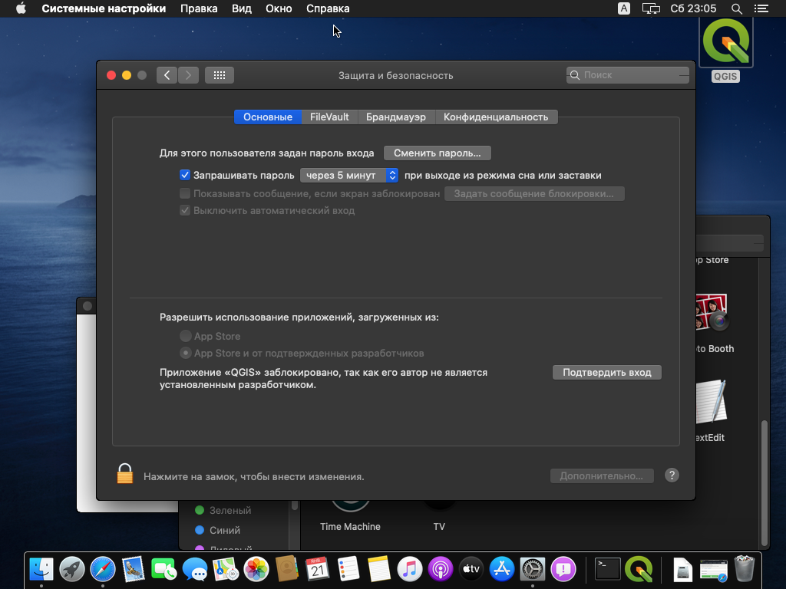

--- 
title: "Топография с основами геодезии"
author: "Карпачевский А.М., Каргашин П.Е."
date: "`r Sys.Date()`"
site: bookdown::bookdown_site
documentclass: book
bibliography: [book.bib, packages.bib]
biblio-style: apalike
link-citations: yes
description: "Топография с основами геодезии"
colorlinks: true
github-repo: iowq750/topography
fontsize: 12pt
mainfont: PT Serif
toc_float:
  collapse: section
  smooth_scroll: true
apple-touch-icon: apple-touch-icon.png
apple-touch-icon-size: 96
favicon: images/favicon.ico
---

# Программное обеспечение для работы {-}

## QGIS {-}

Для выполнения работ в учебном курсе вам потребуется скачать и установить на свой компьютер геоинформационное приложение QGIS. Это свободно распространяемое программное обеспечение, то есть для его установки не требуется покупка или регистрация. 

### Windows {-}

Скачайте с официального сайта последнюю стабильную версию QGIS. По состоянию на 7 февраля 20232 г. это версия 3.28.3-1. Выберите версию в зависимости от разрядности вашей системы. [Перейти к скачиванию](https://qgis.org/downloads/QGIS-OSGeo4W-3.28.3-1.msi){target="_blank"}.

Если на вашем компьютере уже установлена более старая версия QGIS, удалите её перед началом установки новой версии. Вы можете использовать старую версию QGIS для выполнения большинства заданий практикума, однако, если у вас возникнут технические проблемы, возможно потребуется переустановка (рекомендуем проконсультироваться с преподавателем!).

Когда исполняемый файл загрузится, запустите его. Если потребуется, разрешите приложению вносить изменения на вашем устройстве.

Будет показано приветственное окно мастера установки. Нажмите «Далее», чтобы перейти на следующий шаг.

На следующем шаге будет показано лицензионное соглашение QGIS и другого программного обеспечения, входящего в пакет поставки. Нажмите «Принимаю».

На следующем шаге выберите папку для установки и отметьте, нужно ли создавать ярлыки на рабочем столе и в меню «Пуск». По возможности используйте параметры, предлагаемые по умолчанию.

На следующем шаге предлагается запустить процедуру установки. Нажмите «Install». Когда система выдаст запрос на внесение изменений, примите его.

После окончания установки может произойти так, что окно установщика будет смещено с дисплея целиком или частично. В этом случае кликните на иконку окна установщика в панели задач, а затем нажмите **Enter**.

Когда установка будет завершена, вы сможете запустить QGIS одним из следующих способов:

* с помощью ярлыка QGIS Desktop 3.28.3 из папки QGIS Desktop 3.28.3 на рабочем столе;
* с помощью ярлыка приложения QGIS Desktop 3.28.3 в меню «Пуск».

### macOS {-}

Скачайте с [официального сайта](https://www.kyngchaos.com/files/software/qgis/QGIS-macOS-3.4.12-1.dmg){target="_blank"} образ диска QGIS последней вышедшей версии. По состоянию на 7 февраля 2023 г. это версия 3.28.3-1. [Скачать](https://qgis.org/downloads/macos/qgis-macos-pr.dmg){target="_blank"}.

После того как образ загрузится, запустите его. В открывшемся окне нажмите кнопку «Agree», чтобы принять условия лицензионного соглашения:

Дождитесь, пока нужные файлы будут распакованы.

По окончании распаковки появится окно, в котором нужно будет перетащить значок QGIS в папку «Приложения» (*Applications*).

Перетащите значок QGIS в папку «Приложения» (*Applications*). Это запустит процесс установки.

Дождитесь, пока компьютер выполнит необходимые действия.

Запустите приложение QGIS, чтобы убедиться в его работоспособности. Если установка выполнена корректно, откроется главное окно приложения.

При первом запуске может потребоваться разрешение на использование приложений от сторонних разработчиков. В этом случае откройте настройки и включите соответствующую опцию.

По окончании установки можно размонтировать («извлечь») образ диска QGIS.

### Linux {-}

Воспользуйтесь инструкциями по [этой ссылке](https://qgis.org/ru/site/forusers/alldownloads.html#linux){target="_blank"}.

Дополнительную информацию по установке можно найти на [https://qgis.org/ru/site/forusers/download.html](https://qgis.org/ru/site/forusers/download.html){target="_blank"}.

## Изменение языка интерфейса и прочих глобальных переменных QGIS {#global}

В справке используется англоязычная версия QGIS. Чтобы поменять язык интерфейса в меню основного окна QGIS выберите **Установки – Параметры** (**Settings – Options**)

В разделе **Общие улучшения** (**General**) поставьте галочку возле пункта **Переопределить языковые настройки** (**Override system locale**) и выберите напротив пункта **Перевод пользовательского интерфейса** (**User interface translation**) язык **American English**. Нажмите на кнопку **OK**. Изменения вступят в силу после перезагрузки QGIS.

