--- 
title: "Топография с основами картографии"
author: "Карпачевский А.М."
date: "`r Sys.Date()`"
site: bookdown::bookdown_site
documentclass: book
bibliography: [book.bib, packages.bib]
biblio-style: apalike
link-citations: yes
description: "Топография с основами геодезии"
colorlinks: true
github-repo: iowq750/topography
fontsize: 12pt
mainfont: PT Serif
toc_float:
  collapse: section
  smooth_scroll: true
apple-touch-icon: apple-touch-icon.png
apple-touch-icon-size: 96
favicon: images/favicon.ico
---


# Программное обеспечение для работы {-}

## QGIS {-}

Для выполнения работ в учебном курсе вам потребуется скачать и установить на свой компьютер геоинформационное приложение QGIS. Это свободно распространяемое программное обеспечение, то есть для его установки не требуется покупка или регистрация. 

### Windows {-}

Скачайте с официального сайта последнюю версию QGIS. По состоянию на 7 февраля 2025 г. это версия 3.34. Выберите версию в зависимости от разрядности вашей системы. [Перейти к скачиванию](https://download.osgeo.org/qgis/windows/QGIS-OSGeo4W-3.34.15-1.msi){target="_blank"}.

Если на вашем компьютере уже установлена более старая версия QGIS, удалите её перед началом установки новой версии. Вы можете использовать старую версию QGIS для выполнения большинства заданий практикума, однако, если у вас возникнут технические проблемы, возможно потребуется переустановка (рекомендуем проконсультироваться с преподавателем!).

Когда исполняемый файл загрузится, запустите его. Если потребуется, разрешите приложению вносить изменения на вашем устройстве.

Будет показано приветственное окно мастера установки. Нажмите «Далее», чтобы перейти на следующий шаг.


На следующем шаге будет показано лицензионное соглашение QGIS и другого программного обеспечения, входящего в пакет поставки. Нажмите «Принимаю».


На следующем шаге выберите папку для установки и отметьте, нужно ли создавать ярлыки на рабочем столе и в меню «Пуск». По возможности используйте параметры, предлагаемые по умолчанию.


На следующем шаге предлагается запустить процедуру установки. Нажмите «Install». Когда система выдаст запрос на внесение изменений, примите его.


После окончания установки может произойти так, что окно установщика будет смещено с дисплея целиком или частично. В этом случае кликните на иконку окна установщика в панели задач, а затем нажмите **Enter**.

Когда установка будет завершена, вы сможете запустить QGIS одним из следующих способов:

* с помощью ярлыка QGIS Desktop 3.34.15 из папки QGIS Desktop 3.34.15 на рабочем столе;
* с помощью ярлыка приложения QGIS Desktop 3.34.15 в меню «Пуск».


### macOS {-}

Скачайте с [официального сайта](https://www.kyngchaos.com/files/software/qgis/QGIS-macOS-3.4.12-1.dmg){target="_blank"} образ диска QGIS последней вышедшей версии. По состоянию на 7 февраля 2025 г. это версия 3.34.15. [Скачать](https://qgis.org/downloads/macos/qgis-macos-pr.dmg){target="_blank"}.


После того как образ загрузится, запустите его. В открывшемся окне нажмите кнопку «Agree», чтобы принять условия лицензионного соглашения:


Дождитесь, пока нужные файлы будут распакованы.


По окончании распаковки появится окно, в котором нужно будет перетащить значок QGIS в папку «Приложения» (*Applications*).


Перетащите значок QGIS в папку «Приложения» (*Applications*). Это запустит процесс установки.


Дождитесь, пока компьютер выполнит необходимые действия.

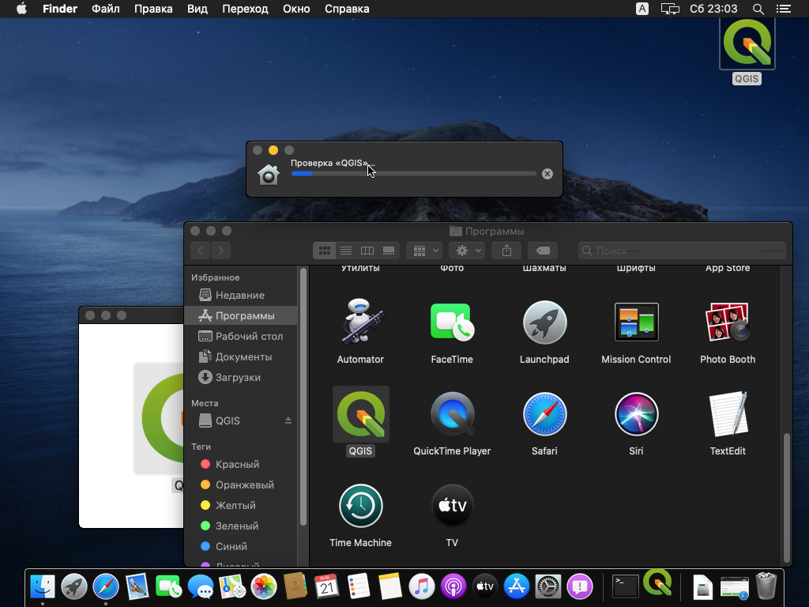

Запустите приложение QGIS, чтобы убедиться в его работоспособности. Если установка выполнена корректно, откроется главное окно приложения.


При первом запуске может потребоваться разрешение на использование приложений от сторонних разработчиков. В этом случае откройте настройки и включите соответствующую опцию.


По окончании установки можно размонтировать («извлечь») образ диска QGIS.


### Linux {-}

Воспользуйтесь инструкциями по [этой ссылке](https://qgis.org/ru/site/forusers/alldownloads.html#linux){target="_blank"}.

Дополнительную информацию по установке можно найти на [https://qgis.org/ru/site/forusers/download.html](https://qgis.org/ru/site/forusers/download.html){target="_blank"}.


## Изменение языка интерфейса и прочих глобальных переменных QGIS {#global}


В справке используется англоязычная версия QGIS. Чтобы поменять язык интерфейса в меню основного окна QGIS выберите **Установки – Параметры** (**Settings – Options**)


В разделе **Общие улучшения** (**General**) поставьте галочку возле пункта **Переопределить языковые настройки** (**Override system locale**) и выберите напротив пункта **Перевод пользовательского интерфейса** (**User interface translation**) язык **American English**. Нажмите на кнопку **OK**. Изменения вступят в силу после перезагрузки QGIS.


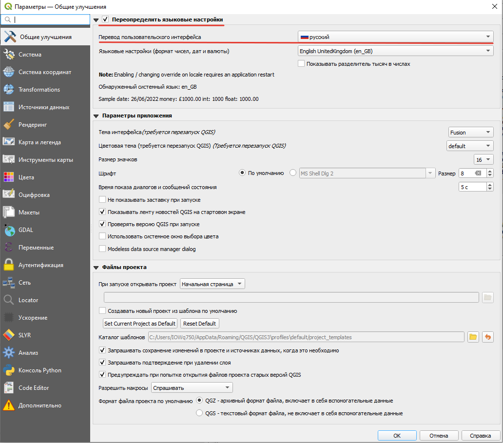

<!--chapter:end:index.Rmd-->

# Координаты на топографической карте {#coordinates}

## Краткая теоретическая информация {#coordinates-theory}
[В начало справки ⇡](#coordinates)

*Эллипсоид* – математическая фигура,описывающая фигуру Земли и характеризующаяся параметрами малой и большой полуоси.

*Географическая (геодезическая) система координат* – система координат на эллипсоиде, задающая счёт широтам и долготам в градусах, а также положение эллипсоида внутри тела земли.

*Спроецированная (прямоугольная) система координат* – система координат проекции, определяющая ориентировку декартовых осей координат и их начало.

## Исходные данные {#coordinates-data}
[В начало справки ⇡](#coordinates)

[Учебная топографическая карта масштаба 1:10 000](https://disk.yandex.ru/i/6OLWDuRwV85cuA){target="_blank"}

[Бланк задания](https://disk.yandex.ru/i/UrzUS6kVB7vwgg){target="_blank"}

[Онлайн-вьюер](https://autode.sk/31q2BNi){target="_blank"}

## Цель работы {#coordinates-task}
[В начало справки ⇡](#coordinates)

Научиться измерять по топографической карте геодезические и прямоугольные координаты точек, решать обратную геодезическую задачу, определять расстояния и ориентирующие углы.

## Выполнение работы в онлайн-вьюере {#coordinates-workflow}
[В начало справки ⇡](#coordinates)

1.	Запустить онлайн-вьюер. Откроется учебная топографическая карта.

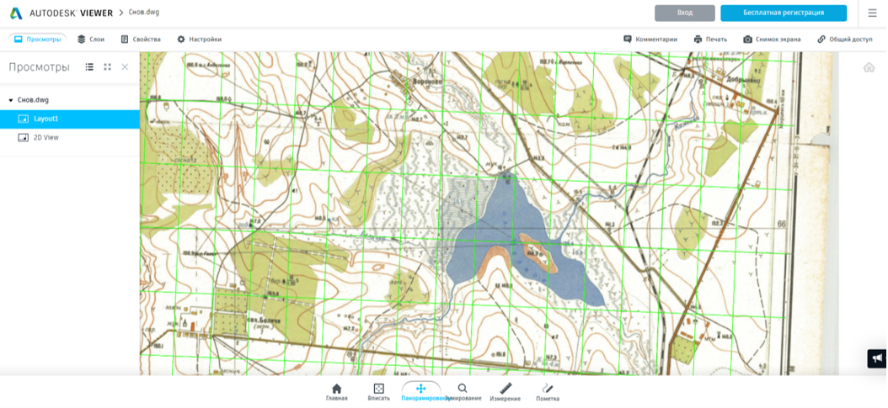
 
Менять масштаб просматриваемого изображения можно колесиком мыши. Дополнительно в файле точки, соответствующие 10-секундным отрезкам, соединены зелеными линиями. Т.е. это дополнительно проведенные параллели и меридианы.

2.	Найти две точки на листе топографической карты, к которым будут привязаны все измерения. Указать их названия в шапке бланка.

```{r}
library(flextable)
library(magrittr)
df <- data.frame(x = 1:10, y = 11:20)
df %>% regulartable() %>% autofit() %>% 
width(j=~x,width=1) %>% width(j=~y,width=1)
```

  Точка     |<!-- --> 
------------|-------
*`1-я (A)`* | 
*`2-я (B)`* | 
 
3.	Описать лист топографической карты, заполнив *таблицу 1* бланка. Указать масштаб карты (численный вид), номер зоны, долготу осевого меридиана зоны, номенклатуру.

  <!-- -->          |<!-- --> 
--------------------|---------
**Номенклатура**    |
**Номер зоны**      |
**Долгота осевого** |
**Масштаб карты**   |

4.	Определить геодезические координаты точек – широту (B) и долготу (L) – с точностью до 1 секунды. Нужно выбрать инструмент **Измерение** (расположено на нижней панели меню).  Откроется дополнительное меню для измерений. Необходимо зайти в Настройки, установить единицы измерений (сантиметры), точность (до 0,1). Обязательно подвиньте рычажок **Enable free measure**.


 
Нужно провести перпендикуляр от выбранной точки до ближайших южной и западной зеленых линий, т.е. до ближайшей южной параллели с известной широтой и ближайшего западного меридиана с известной долготой. Когда вы отметите вторую точку отрезка, появится расстояние в см. Нужно перевести расстояние в секунды, если известно, что 10-секундный отрезок по широте составляет 3,1 см, а по долготе - 1,8 см.

Заполнить *таблицу 3*.

  Номера точек  | B (широта) |  L (долгота)
----------------|------------|---
**1 (A)**       |            |
**2 (B)**       |            |

5.	Определить прямоугольные координаты точек – абсциссу и ординату – с точностью до 5 м. 
Измерения проводить аналогично пункту 4, но перпендикуляры проводить к линиям километровой сетки. Вычислить разность соответствующих координат точек. Заполнить таблицу 2.
Номера точек	Прямоугольные координаты, м

  Номера точек         | X | Y
-----------------------|---|---
**1 (A)**              |   |
**2 (B)**              |   |
**$\Delta$ =**         |   |

6.	Измерение расстояния и дирекционного угла:
Проведите измерение расстояния от 1-й до 2-й точки S в см, переведите в метры на местности, значение внесите в *таблицу 4*.

  <!-- -->                                               | Измеренный |  Вычисленные
---------------------------------------------------------|------------|------------
**Дирекционный угол ($\alpha$) направления: 1-2 (A,B)**  |            |
**Расстояние (S) между точками: 1-2 (A-B), м**           |            |

Выберите инструмент измерения углов. Чтобы измерить дирекционный угол, нужно отметить 3 точки: первая точка (<span style="color:red">**1**</span>) это проекция вашей точки A на ось Y (выберите горизонтальную линию сетки севернее вашей точки, поскольку дирекционый угол считается от северного направления линии сетки (оси Х) до выбранного направления), вторая (<span style="color:red">**2**</span>) - ваша точка А, третья (<span style="color:red">**3**</span>) - ваша точка В.


>Обратите внимание, что измерения углов в программе ведутся по часовой (от 0° до 180°) и против часовой (от 0° до 180°). Если измеряемый Вами угол больше 180°, необходимо полученное значение вычесть из 360°. На рисунке при измеренном значении 131,8° дирекционный угол будет равен 228,2°. Измеренное (или рассчитанное) значение дирекционного угла $\alpha$ выбранного направления нужно внести в строки таблиц 4 (измеренные) и 5.
**Внимание! Измеренное значение вносится в бланк дважды и должно быть одинаковым!**

7.	Вычислить дирекционный угол А выбранного направления и расстояние S, решив обратную геодезическую задачу. Полученные значения округлить до до 0,5° и 1 м соответственно, данные занести в таблицу 4. Сравнить измеренные и вычисленные значения дирекционного угла и расстояния. Разность значений не должна превышать 1° для углов и 10 м для расстояний.

8.	Определить, пользуясь формулами и информацией из зарамочного оформления карты, другие ориентирующие углы выбранного направления (точка 1 – точка 2), последовательно заполняя *таблицу 5*.

  Ориентируемая линия	1-2 (A-B)  | Угол
---------------------------------|---
**Дирекционный угол $\alpha$**   |   
**Сближение меридианов $\gamma$**|   
**Геодезический азимут A**       |   
**Магнитное склонение	D**        |   
**Магнитный азимут	Aм**         |   

●	Определить среднее значение Гауссова сближения меридианов $\gamma$ на листе карты.

●	Вычислить геодезический азимут А выбранного направления.

●	Вычислить величину склонения магнитной стрелки D на текущую дату.

●	Вычислить магнитный азимут Am выбранного направления.


----
_Карпачевский А.М._ **Топография с основами картографии**. М.: Географический факультет МГУ, `r lubridate::year(Sys.Date())`.
----

<!--chapter:end:Ref00_Coordinates.Rmd-->

# Дешифрирование снимков {#interpretation}

## Краткая теоретическая информация {#interpretation-theory}
[В начало справки ⇡](#interpretation)

_Данные дистанционного зондирования_ – материалы космической или воздушной (аэро-) съёмки, представленные преимущественно снимками.

_Дешифрирование_ – распознавание и отрисовка в условных знаках объектов и явлений по данным дистанционного зондирования.

_Дешифровочный признак_ – некая особенная черта объекта, по которому он определяется по данным дистанционного зондирования.

_Прямые дешифровочные признаки_ – признаки самих объектов.

_Косвенные дешифровочные признаки_ – прямые дешифровочные признаки объектов-индикаторов.

_Признак формы (геометрический)_ – характерные формы объектов.

_Признак размера (геометрический)_ – абсолютный, но чаще относительный размер объекта.

_Признак тени (геометрический)_ – падающая тень объекта (на поверхности земли) или собственная тень объекта (его затенённая часть).

_Признак яркости (яркостный)_ – яркость объекта на снимке, зависящая от количества отражённого солнечного света.

_Признак цвета (яркостный)_ – совокупность яркостей объекта в синем, зелёном и красном диапазоне спектра.

_Спектральный образ (яркостный)_ – совокупность яркостей во всех диапазонах спектра (не только в видимом).

_Текстура (структурный)_ – сочетание неразличимых элементов изображения, формирующих единое целое.

_Структура (структурный)_ – сочетание различимых элементов изображения (несколько текстур).

_Рисунок (структурный)_ – сочетание нескольких текстур и структур.

## Исходные данные {#interpretation-data}
[В начало справки ⇡](#interpretation)

[Участки дешифрирования (Воскресенск)](https://yadi.sk/d/eOVRxRZiEh_PWQ){target="_blank"}

[Участки дешифрирования (Петровск)](https://disk.yandex.ru/d/_00irQJ8Kw3bWQ){target="_blank"}

[Бланк работы](https://yadi.sk/i/x5atjx5eSHcTGw){target="_blank"}

## Цель работы {#interpretation-task}
[В начало справки ⇡](#interpretation)

Для своего участка снимка провести дешифрирование 10 типов объектов по мозаике космических снимков Google. Заполнить бланк, описав использованные дешифровочные признаки и дав расшифровку условных знаков.

## Работа с Google My Maps (Мои карты) {#interpretation-google}
[В начало справки ⇡](#interpretation)

Зайдите в свой аккаунт Google в браузере и пройдите по [ссылке](https://www.google.com/maps/d/u/0/?hl=ru){target="_blank"}. Google Мои карты – это специальный сервис для создания простых веб-карт, которыми можно поделиться с другими с помощью обычной ссылки. Для создания новой карты нажмите на большую кнопку слева **+СОЗДАТЬ НОВУЮ КАРТУ**. Откроется окно, которое будет выглядеть следующим образом:


По умолчанию ваша карта называется «Карта без названия». Вы можете поменять название, щёлкнув по нему слева вверху страницы. Чтобы импортировать данные, нужно нажать на кнопку **Импорт** и выбрать **KMZ** файл, который был вам ранее предоставлен. После добавления данных охват карты подстроится под эти данные. Для того чтобы ваша карта по умолчанию открывалась для конкретного охвата, нажмите на три точки возле заголовка и выберите пункт **Задать область просмотра по умолчанию**.

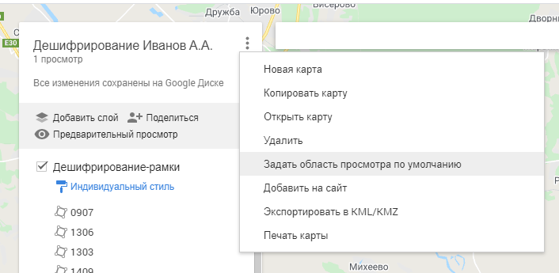

Выбрать мозаику спутниковых снимков можно в слое с базовой картой (в самом низу списка слоёв).


Для того чтобы задать стиль или настроить подписи для рамок, нажмите на кнопку настройки стиля под названием слоя. Его можно сделать либо индивидуальным, либо стандартным. Там же можно вывести подписи рамок по их названию.


Для отрисовки объектов на карте необходимо создать новый слой, нажав на кнопку **Добавить слой**. Этот слой можно назвать по типу объектов, которые будут в нем храниться. Приблизьтесь к объекту, который вы хотите отрисовать. Для начала собственно отрисовки выберите кнопку 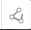 под строкой поиска. Обратите внимание, что рисовка происходит в активном слое – у него слева синяя вертикальная полоска. Левой кнопкой мыши расставляются узлы объекты. Если это площадной объект, то последний узел нужно замкнуть на первый. Замыкание полигона автоматически завершает отрисовку объекта, после чего перед вами появляется окошко, где вы можете задать его название, а также стиль (цвет заливки, обводка, прозрачность). Завершить отрисовку линейного объекта можно двойным щелчком левой клавиши мыши.

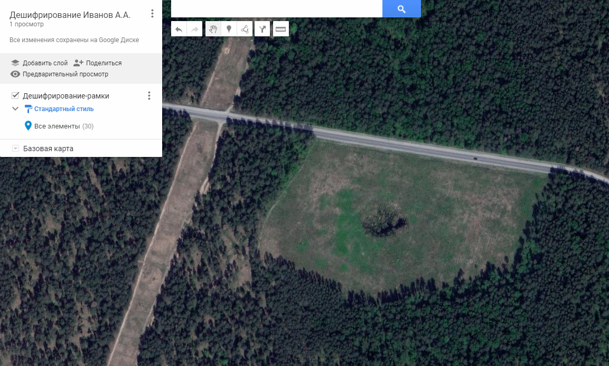

Когда ваша карта будет готова, вы можете скопировать ссылку и прислать её преподавателю на проверку вместе с бланком. Для этого нажмите кнопку **Поделиться**. Включите общий доступ по ссылке к карте и скопируйте ссылку.

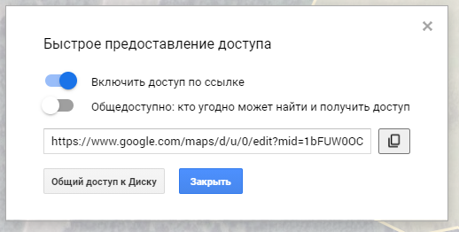

## Заполнение бланка {#interpretation-blank}
[В начало справки ⇡](#interpretation)

Бланк следует заполнить следующим образом по колонкам:

1) Условный знак;

2) Дешифрируемый объект;

3) перечисляются дешифровочные признаки, которые вы использовали (их, как правило, несколько!);

4) Классификационные особенности признаков, например, прямой геометрический, прямой яркостный, прямой структурный, либо косвенный геометрический и т.д.

5) Конкретный признак, по которому дешифрируется объект, то есть, если форма, то какая форма, если яркость, то какая яркость, если косвенный признак, то по какому объекту.

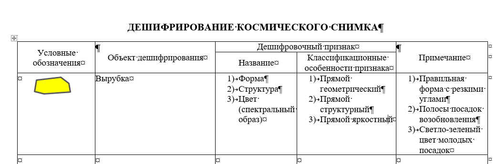

----
_Карпачевский А.М._ **Топография с основами картографии**. М.: Географический факультет МГУ, `r lubridate::year(Sys.Date())`.
----

<!--chapter:end:Ref00_Interpretation.Rmd-->

# Работа со стереопарой снимков {#stereo}

## Краткая теоретическая информация {#stereo-theory}
[В начало справки ⇡](#stereo)

_Стереоэффект_ – пространственное восприятие объекта при рассматривании двух его плоских перспективных изображений.

_Стереопара_ – снимки, полученные из разных точек пространства на одну и ту же территорию, либо объект.


_Базис съёмки_ ($b$) – расстояние в масштабе снимков между точками съёмки (центрами их проекций).

_Продольный параллакс_ ($p$) – разность координат $x$ соответственных точек на снимках ($x_л - x_п$).

_Поперечный параллакс_ ($q$) – разность координат $y$ соответственных точек на снимках ($y_л - y_п$).

_Разность параллаксов_ ($\Delta p$) – разница в смещении координат соответственных точек, обусловленная разницей в их высоте ($p_2 - p_1$).


_Формула превышений_ – приблизительная формула для вычисления превышений точек по стереопарам снимков через разность параллаксов двух точек $\Delta p$.

$$h = H\frac{\Delta p }{b + \Delta p}$$

## Установка программного обеспечения {#stereo-soft}
[В начало справки ⇡](#stereo)

Для практической работы вам понадобится открытая учебная фотограмметрическая программа **E-foto**. Информацию о ней можно найти на домашнем сайте ([http://www.efoto.eng.uerj.br/](http://www.efoto.eng.uerj.br/){target="_blank"}), там же можно скачать себе дистрибутив программы. Для этого перейдите во вкладку **DOWNLOAD – Latest Version**.


Запустите скачанный пакет установщика и установите программу.

## Исходные данные {#stereo-initial}
[В начало справки ⇡](#stereo)

В работе будут использоваться данные аэрофотосъёмки на учебный полигон Сатино. Съёмка производилась с помощью камеры АФА-41/10.
Примерная высота съёмки – 1500 м;

Фокусное расстояние камеры – 96,78 мм;

Базис съёмки между снимками 10182 и 10183 составляет 71 мм, между снимками 10183 и 10184 – 69 мм, между 10184 и 10185 – 69 мм.

1) Скачайте данные проекта, доступные по [ссылке](https://yadi.sk/d/3a5RAakJsZoAYg){target="_blank"}.

Проект включает в себя собственно файл проекта с расширением *.epp и четыре аэрофотоснимка.

2) [Топографическая карта масштаба 1:10 000](https://yadi.sk/i/gX-dbnhTKGme_A){target="_blank"}

3) [Аэрофотоснимки с нанесённой сеткой](https://yadi.sk/d/dzFeiJ2zVdx_Hw){target="_blank"}

4) [Бланк задания](https://yadi.sk/i/wJ_0jiAc-nkO6A){target="_blank"}

## Цель работы {#stereo-task}
[В начало справки ⇡](#stereo)

Научиться выполнять измерения по стереопаре аэрофотоснимков с использованием формулы превышений и специального программного обеспечения. Построить гипсометрический профиль по данным измерений двумя способами и топографической карты.

## Работа в стереокомпараторе {#stereo-stereoplotter}
[В начало справки ⇡](#stereo)

Разместите папку с проектом у себя на компьютере так, чтобы путь к ней был без пробелов, кириллицы, дефисов и иных специальных символов. Запустите проект **Stereo.epp** с помощью программы **E-foto**.

Откроется окно менеджера проекта. Слева приведена структура проекта, а по центру - содержание.


В меню проекта выберите пункт **Execute – Stereo Plotter**. Откроется окно с анаглифными изображением стереопары снимков. Для эффективной работы с анаглифами рекомендуется использовать специальные очки, однако в данной программе измерения можно проводить и без них.


Если вы работаете в анаглифических очках и изображение на экране двоится, зажмите **SHIFT** и подвиньте изображение до тех пор, пока рассматриваемый участок не сольётся в объёмное изображение.

Для измерения высоты в точке нужно добавить точку с помощью кнопки , далее необходимо выбрать кнопку . С помощью колеса мыши можно посадить марку на измеряемый объект. На увеличенных фрагментах левого и правого изображения снизу будут показываться эти марки в «монокулярном» режиме. Как только мнимая марка слилась (реальные марки оказались на соответственных точках в маленьких окошках), нажмите левую кнопку мыши и в окне справа появятся измерения для данной точки. В случае, если вы замечаете поперечный параллакс (положение точек не совпадает по оси y), необходимо зажать **CTRL** и крутить колесо мыши до тех пор, пока поперечный параллакс не пропадёт. Обратите внимание, что для измерения каждой новой точки необходимо предварительно добавить её с помощью . После снятия измерений результаты будут показаны на панели справа в виде координат X, Y, Z.

----
_Карпачевский А.М._ **Топография с основами картографии**. М.: Географический факультет МГУ, `r lubridate::year(Sys.Date())`.
----

<!--chapter:end:Ref00_Stereo.Rmd-->

# Географическая привязка {#georeference}

## Краткая теоретическая информация {#georeference-theory}
[В начало справки ⇡](#georeference)

_Эллипсоид_ – математическая фигура,описывающая фигуру Земли и характеризующаяся параметрами малой и большой полуоси.

_Географическая (геодезическая) система координат_ – система координат на эллипсоиде, задающая счёт широтам и долготам в градусах, а также положение эллипсоида внутри тела земли.

_Спроецированная (прямоугольная) система координат_ – система координат проекции, определяющая ориентировку декартовых осей координат и их начало.

_Географическая привязка_ – сопоставление точек изображения и точек местности.

_Трансформация_ – перевод данных из одной системы координат в другую.
 
## Исходные данные {#georeference-data}
[В начало справки ⇡](#georeference)

[Учебная топографическая карта масштаба 1:25 000](https://yadi.sk/i/mvQ3lJJVNVJiuA){target="_blank"}

[Снимок №1](https://yadi.sk/i/Zo4U3AuslrxwAg){target="_blank"}

[Снимок №2](https://yadi.sk/i/_Yl8PMShZ-7FIw){target="_blank"}

[Снимок №3](https://yadi.sk/i/JKSSi97_dbu7Lg){target="_blank"}

[Бланк задания](https://yadi.sk/i/WDWZgCLA2A539Q){target="_blank"}

## Цель работы {#georeference-task}
[В начало справки ⇡](#georeference)

Привязать топографическую карту, а затем к ней привязать аэрофотоснимок. Оценить точность привязки карты и снимка. Определить детализацию снимку и соответствующий ей масштаб. Обосновать выбор опорных точек для привязки снимка, указав на отличия ситуации, отражённой на карте и на снимке.

## Системы координат в QGIS {#coordinate-systems}
[В начало справки ⇡](#georeference)

Системы координат в QGIS задаются в свойствах проекта. Для этого нужно открыть пункт меню **Проект – Свойства**.


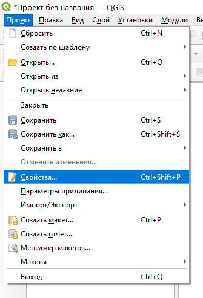

Перейдите на вкладку **Системы координат**. В среднем окне видно две свёрнутые группы систем координат – географические и прямоугольные (спроецированные).
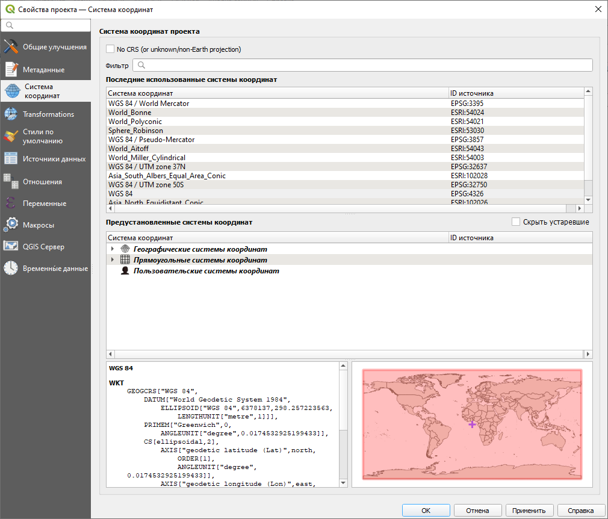

Если раскрыть эти группы, то вы увидите полный перечень систем координат по алфавиту. Например, поскольку известно, что для старых отечественных топографических карт используется проекция Гаусса-Крюгера на основе системы координат координат Пулково 1942 года, то можно пролистать перечень прямоугольных СК до Pulkovo 1942 и далее найти нужную зону проекции Гаусса-Крюгера нужной ширины (они бывают 3° и 6°). Также нужные проекции можно искать через строку поиска вверху окна.


## Привязка топографической карты {#georeference-topo}
[В начало справки ⇡](#georeference)

Добавьте топографическую карту в проект, нажав на кнопку . Поскольку открытая карта на данный момент не привязана, справа от слоя в таблице слоёв вы увидите знак вопроса.


> Если вы не видите карту, то, вероятно, она расположилась где-то за пределами вашего экрана. Чтобы увидеть её, нажмите правой кнопкой мыши по слою и выберете **Увеличить до слоя**. Обратите внимание на значения координат и масштаб внизу окна. Что они могут означать?

Запустите модуль привязки через меню **Layer – Georeferencer** (**Слои – Привязка растров...**).


> Если вы не видите такого пункта меню, то зайдите в **Установки – Модули и управление модулями**, вбейте в поиск «привязка» и включите соответствующий модуль, поставив галочку.

Откроется отдельное окно привязки. Нажмите на кнопку **Открыть растр** , добавьте привязываемый растр. Нажмите на кнопку 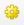. В качестве типа трансформации для топографических карт должно быть достаточно полиномиального первой степени. Укажите целевую систему координат (в которой должна находиться привязываемая карта), а также путь для сохраняемого файла. Поставьте галочку напротив последнего пункта, чтобы привязанное изображение автоматически добавилось в проект.

> Сохраняйте файлы в папку с путями без латиницы, пробелов и спецсимволов.


Нажмите **OK**. Теперь вы можете приступать к привязке. Щелчок левой кнопкой мыши по привязываемому изображению откроет окно, куда будет предложено ввести координаты. Выберите пересечения линий прямоугольной сетки в качестве точек с известными прямоугольными координатами. Введите соответствующие значения единицах проекции (метрах). Убедитесь в том, что у вас выбрана система координата ввода, совпадающая с системой координат карты.


> Обратите внимание, что оси X и Y в геоинформационном программном обеспечении ориентированы как в математике. Для координаты X вводить номер зоны **не нужно**.

Введите не менее 5 точек равномерно по всей карте – обычно это углы и центр листа. Внизу окна появится таблица с вашими точками привязки – будут указаны координаты этих точек в исходной СК изображения и в целевой СК. После ввода более трёх точек таблице внизу должны появиться расчётные невязки. Убедитесь в том, что невязки имеют значение около одного пикселя.


Если невязка большая, нужно удалить неправильную опорную точку, нажав на кнопку  и выбрав точку на карте. Для добавления новой точки выберите кнопку . Когда точность трансформации станет удовлетворительной, запустите сам процесс трансформации, нажав на кнопку . Закройте модуль привязки.

Обратите внимание, что у вас теперь есть два слоя с картой – один исходный без привязки, а второй с привязкой. Выделите слой с привязанной картой и щёлкните ПКМ. В меню выберите **Zoom to layer(s)** – приблизиться к слою. Обратите внимание на координаты в нижнем окошке – они должны соответствовать координатам карты. Теперь непривязанную карту можно удалить из слоёв.

## Привязка аэрофотоснимков {#georeference-aerial}
[В начало справки ⇡](#georeference)

Привязка материалов аэрофотосъёмки происходит аналогично, но в качестве опорных точек выступают соответственные точки на топографической карте. Для этого нужно сопоставить снимок с картой и найти эти точки. В модуле привязке выберите точку, но при появлении окна не вводите координаты, а выберите кнопку **С карты**.


Расставьте минимум 5 точек равномерно по всему снимку. В параметрах преобразования укажите тип трансформации – **проективное**. Именно такое преобразование используется для аэрофотоснимков.

## Измерения по карте и снимку {#georeference-measure}
[В начало справки ⇡](#georeference)

Для измерений по карте или по снимку используется инструмент линейки , расположенный на панели атрибутов. Если у вас такой панели нет, её можно открыть, щёлкнув правой кнопкой мыши по пустому месту сверху.

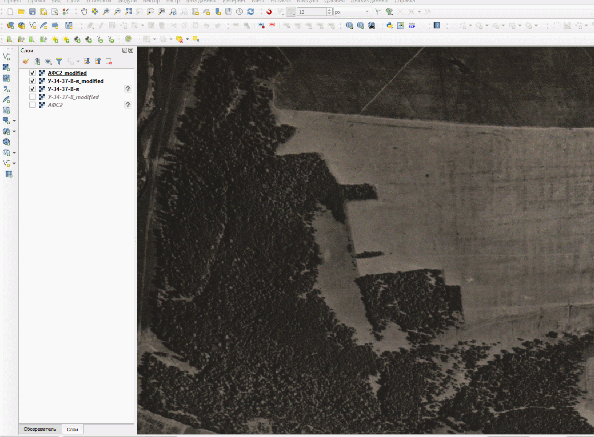

----
_Карпачевский А.М._ **Топография с основами картографии**. М.: Географический факультет МГУ, `r lubridate::year(Sys.Date())`.
----

<!--chapter:end:Ref01_Georeference.Rmd-->

# Векторизация топографической карты {#digitize}

## Исходные данные {#digitize-initial}
[В начало справки ⇡](#digitize)

Привязанная топографическая карта.

## Цель работы {#digitize-task}
[В начало справки ⇡](#digitize)

Научиться создавать базу пространственных данных для картографирования, научиться проводить векторизацию объектов на топографической карте и снимке.


## Создание базы пространственных данных {#digitize-database}
[В начало справки ⇡](#digitize)

Составление карты подразумевает, прежде всего, создание векторных наборов данных.

> **Векторные данные** – данные, которые описываются набором координат.

На данный момент нам необходимо знать, что векторные объекты могут относиться к трём _основным_ типам геометрии: 1) точечные; 2) линейные; 3) полигональные.

> **Классы объектов** – это наборы однородных векторных данных одного типа геометрии с одним набором атрибутов, относящие к одному роду пространственных объектов или явлений. Например, на почвенной карте будет визуализироваться класс полигональных объектов почв, класс полигональных объектов механического состава, класс внемасштабных почвенных ареалов.

> **Атрибут класса объектов** – это формализованное описание какого-либо свойства класса объектов. Атрибутов может быть много, каждый из них отвечает за различные аспекты пространственных объектов или явлений. У класса почв это может быть атрибут типа, подтипа, pH, содержания гумуса, мощности и т.д. Атрибуты строго типизируются, то есть при создании указывается тип данных, который будет храниться в атрибутивном поле: _целочисленные данные_, _действительные числа_, _числа с плавающей точкой_, _логические значения_, _текстовые данные_ и ряд других.

QGIS поддерживает различные форматы пространственных данных. Среди них наиболее удобным и современным для хранения и работы считается формат **Geopackage**. По сути это формат базы пространственных данных, внутри которой мы можем складывать различные классы объектов. Для создания базы данных формата **Geopackage** откройте окно Браузера внутри QGIS. Если его нет, включите его в выпадающем списке при щелчке правой кнопкой мыши по пустой панели. Найдите каталог, в котором вы хотите создать базу данных (лучше всего, чтобы путь к этой базы состоял из символов латинского алфавита, не содержал дефисов, пробелов и спецсимволов). Правой кнопкой мыши щелкните по каталогу, выберете **Новые – Geopackage**. Откроется окно, которое помимо самой базы данных предложит создать класс объектов внутри неё. В поле Имя таблицы введите имя класса объектов латинскими символами, лучше, чтобы это был английский перевод соответствующего вида картографируемого объекта, а не транслитерация.

Другой вариант создания базы данных – нажмите на кнопку  на панели менеджера источников данных.


В поле **Тип геометрии** укажите соответствующую геометрию объектов.

> Обратите внимание, для площадных объектов необходимо выбирать полигональную геометрию, для линейных (реки, горизонтали и др.) – линейную, для внемасштабных (точечных) знаков – точечную.

Укажите спроецированную систему координат. Если указать геодезическую систему координат, то велика вероятность, что при векторизации объектов возникнут курьёзные ситуации.
В разделе **New Field** можно указать имя, типа и длину атрибутивного поля создаваемого класса объектов.

Каждый последующий класс объектов создавайте внутри базы данных. Таким образом вы сформируете единое хранилище для всех картографируемых объектов.

## Векторизация {#digitize-vectorize}
[В начало справки ⇡](#digitize)

Созданные классы объектов в базе данных можно добавить в перечень слоев проекта простым перетаскиванием, либо дважды щёлкнув по ним в Браузере. Для редактирования объектов и добавления новых объектов в класс необходимо войти в режим редактирования. Для этого можно щелкнуть правой кнопкой мыши по слою и выбрать пункт **Режим редактирования**, либо выделить слой и найти на панели инструментов кнопку . Активация режима редактирования откроет некоторые другие кнопки на панелях. Например, для полигонального объекта появится кнопка , с помощью которой можно создать новый полигон в слое. Для других типов геометрии иконка будет немного отличаться.


Рисовка контура осуществляется с помощью левой кнопки мыши. Для завершения рисовки объекта нажмите правую кнопку мыши. Для редактирования отдельных вершин нажмите на кнопку . После этого у объекта кружочками выделятся вершины.


Курсор в таком режиме может вести себя тремя разными способами:

1)	При выделении вершины вы можете изменить её положение

2)	При выделении ребра вы можете сдвинуть его вместе со смежными вершинами

3)	При нажатии на плюсик в центре ребра добавляется новая вершина

Нажатие на клавишу **DELETE** позволяет удалить вершину.

При векторизации объектов часто возникает необходимость пристыковать вершины одного объекта к вершинам другого объекта. Для корректной и комфортной пристыковки нужно включить панель Инструменты прилипания (**snapping**). Кнопка в виде магнита  активирует прилипание. Остальные кнопки на данной панели позволяют уточнить параметры прилипания, в том числе расстояние, на котором оно начинает действовать.

Если вам необходимо повторить значительную часть существующего контура при создании нового, то удобнее всего воспользоваться трассировкой (**Tracing**), нажав на кнопку  на панели инструментов прилипания. После этого при ведении на небольшом расстоянии от контура новый контур будет автоматически пристыковываться к существующем.


_Дополнительные инструменты оцифровки_


Соответствующую панель вы так же, как и предыдущую, можете найти в выпадающем списке панелей.


На данной панели доступны инструменты для векторизации параллельных и перпендикулярных линий, для перемещения объектов, создания внутренних колец (по сути – дырки в полигоне), разрезания объектов, склеивания объектов и другие.


Выбрать объекты, например, для склеивания можно с помощью инструмента выделения .


Не забывайте регулярно сохранять изменения в геометрии слоев с помощью кнопки на панели . Также не забывайте изменять изменения в самом проекте (они касаются набора слоев, их оформления, некоторых параметров) с помощью кнопки .


## Работа с атрибутами {#digitize-attributes}
[В начало справки ⇡](#digitize)

Векторизация предназначена для показа геометрической составляющей объектов и явлений на карте. Для показа семантических (смысловых) различий в явлениях используются атрибуты. Преимущество ГИС-пакетов по сравнению с графическими пакетами заключается в том, что мы можем напрямую сопоставить символику слоя и значения атрибутивных полей. Например, если мы показываем качественным фоном какое-либо явление, то каждой явление должно иметь своё значение в атрибутивной таблице. Открыть атрибутивную таблицу слоя можно, нажав правой кнопкой мыши по нему и выбрав пункт **Открыть таблицу атрибутов**.


Для редактирования атрибутов необходимо зайти в режим редактирования с помощью кнопки . Для добавления или удаления атрибутивных столбцов также необходимо зайтив в режим редактирования, после чего появятся соответствующие кнопки  и .

> Обратите внимание, что изменение структуры атрибутивной таблицы в режиме редактирования – это исключительно «фишка» QGIS. Другие известные ГИС-пакеты, например ArcGIS, позволяют это делать только вне режима редактирования.

Каждая строка в атрибутивной таблице – это, по сути, один объект в классе объектов. Выделять объекты в атрибутивной таблицы можно с помощью нажатия левой кнопки мыши по левому краю строки. Для выбора нескольких строк подряд можно «тянуть» выделение левой кнопкой мыши, либо выделить первый и последний объект с зажатым **SHIFT**. Для выбора нескольких отдельных строк зажмите **CTRL**. Выделяемые в атрибутивной таблице объекты будут подсвечиваться жёлтым цветом на карте. Для приближения к выбранному объекту нажмите на кнопку **Увеличить карту до выделенных строк**

----
_Карпачевский А.М._ **Топография с основами картографии**. М.: Географический факультет МГУ, `r lubridate::year(Sys.Date())`.
----

<!--chapter:end:Ref02_Topo.Rmd-->

# Оформление в условных знаках {#symbols}

## Исходные данные {#symbols-initial}
[В начало справки ⇡](#symbols)

Для работы с оформлением топографического плана или карты скачайте [символы](https://yadi.sk/d/mb1wTvAUUAgVUQ){target="_blank"} и [топографические шрифты](https://yadi.sk/d/G_3EVFLqg3C5pA){target="_blank"}.

## Цель работы {#symbols-task}
[В начало справки ⇡](#symbols)

Научиться оформлять векторные слои согласно принятым условным обозначениям в ПО QGIS.

## Оформление в условных знаках {#symbols-symbols}
[В начало справки ⇡](#symbols)

Для оформления наших слоёв проекта в условных знаков необходимо дважды щёлкнуть по слою. Откроются его свойства, среди которых в данный момент нас интересует **Стиль**. Для точечного слоя по умолчанию будет выставлен **Простой маркер**.


С ним особо ничего не сделаешь – можно поменять геометрическую фигуру, изменить размер или цвет. Для использования более разнообразной библиотеки символов нужно в типе слоя выбрать **SVG-маркер**.


Переместите папку со скаченными символами в директорию, где находятся остальные SVG-символы. Например, на Windows 10 это, вероятно, будет следующий путь:

**C:\\Users\\%USERNAME%\\AppData\\Roaming\\QGIS\\QGIS3\\profiles\\custom\\svg**

При выборе символа внизу появляется адрес к данному символу у вас на компьютере. Размер символа и его цвет вы можете настраивать в этом же окне.

Для площадных объектов всё работает похоже, но немного сложнее. По умолчанию для таких слоёв даётся заливка цветом, которую можно менять. Дополнительно можно менять обводку. Для того чтобы заполнить наши площадные объекты штриховкой из специальных символов, например, газона, нужно выбрать **Тип слоя – Заливка маркерами**.


После этого иерархия структуры значка в верхнем окошке вырастет – там добавится простой маркер. Как заменить простой маркер на SVG-символ вы уже знаете. Для настройки шага (частоты) маркеров необходимо выделить **Заливка маркерами** в иерархии структуры стиля.


Обратите внимание, что здесь можно настроить смещение символов, чтобы маркеры располагались, например, в шахматном порядке.


**Детальные настройки символов сверяйте с Условными обозначениями, проверяйте, как они выглядят в режиме макета.**

**Сохраните проект.**

## Оформление макета {#symbols-layout}
[В начало справки ⇡](#symbols)


Итоговое оформление карты/плана в ГИС-пакете QGIS осуществляется в режиме макета. Для этого надо найти пункт меню **Проект – Создать макет**. После ввода имени макета откроется отдельное окно, в котором нам предстоит скомпоновать наше картографическое изображение.


 
На пустом листе необходимо разместить саму карту, текстовые элементы, масштабную линейку с помощью специальных кнопок слева.


 
После добавления элементов карты их перечень появляется в окошке справа вверху.


 
Если выделить элемент, ниже открываются его свойства. Выделите элемент карты, запишите в его свойства масштаб. В разделе Сетки нажмите на плюсик, чтобы добавить сетку. Выделив сетку и нажав на кнопку **Modify Grid**, мы можем редактировать её отображение.


 
В свойствах сетки выберите вид сетки – перекрестие, шаг сетки – 25 метров, цвет линии – зеленый.
В разделе Рамки выберите **exterior ticks** для показа выходов сетки наружу рамки. Длину выходов установить 7 мм.


В разделе **Draw Coordinates** сориентируйте боковые подписи выходов сетки вертикально вдоль рамки.


 
В свойствах карты включите опцию Рамка. Настройте её ширину в соответствии с требованиями.


 
Расположите масштаб и стандартную информацию о листе топографического плана в текстовых элементах сверху и снизу рамки.


Настройте размер и расстояние между условными знаками в соответствии с требованиям.

Изменить размер листа можно щелчком правой кнопкой по листу. После этого справа откроются свойства элемента, где можно указать размеры листа.


Для экспорта растрового изображения выберите **Макет – Экспорт в …**


----
_Карпачевский А.М._ **Топография с основами картографии**. М.: Географический факультет МГУ, `r lubridate::year(Sys.Date())`.
----

<!--chapter:end:Ref03_Topo_symbology.Rmd-->

# Использование QGIS во время полевой топографической практики {#practice}


В этой справке вы найдёте информацию об основных технических приёмах работе в ГИС-пакете QGIS на учебной топографической практике. Для универсализации терминов, названий функций и элементов интерфейса в справке используется англоязычный пользовательский интерфейс. О том, как менять язык программы, вы можете узнать в [начальном разделе](https://iowq750.github.io/Topography/#global){target="_blank"}.


## Создание схемы теодолитного хода {#practice-theod}


### Шаблон схемы теодолитного хода {#practice-theod-template}

[Схема теодолитного хода в формате PDF](https://disk.yandex.ru/i/Z3H_BOK2KYfDRQ){target="_blank"}


[Проект шаблона схемы теодолитного хода для QGIS](https://disk.yandex.ru/d/JcXRhKuiqoVTLg){target="_blank"}


### Работа с базой данных {#practice-theod-DB}
[В начало справки ⇡](#practice-theod)

Для схемы теодолитного хода следует создать отдельную базу данных, в которой будет несколько классов объектов:

●	Стороны хода

●	Дуги внутренних углов хода

●	Точки хода.

Создать базу данных можно, нажав правой кнопкой по выбранной вами директории в браузере (проводнике). Выберите пункт меню **New – Geopackage**.


У вас откроется окно создания базы данных, где вы можете задать имя базы данных, сразу же создать один из классов, указав его тип геометрии и систему координат.


Остальные классы объектов вы можете создать, щёлкнув правой кнопкой мыши по уже созданной базе данных и выбрав пункт меню **New Table**.


### Черчение хода {#practice-theod-draw}
[В начало справки ⇡](#practice-theod)

Для нанесение точек хода необходимо добавить в проект из базы данных точечный класс объектов простым перетаскиванием, либо дважды щёлкнув по ним в Браузере. Для редактирования объектов и добавления новых объектов в класс необходимо войти в режим редактирования. Для этого можно щелкнуть правой кнопкой мыши по слою и выбрать пункт **Режим редактирования** (**Toggle Editing**), либо выделить слой и найти на панели инструментов кнопку . Активация режима редактирования откроет некоторые другие кнопки на панелях. Например, для точечного класса объекта появится кнопка . Нажав на эту кнопку, вы сможете поставить точку в произвольном месте.

Чтобы поставить точки по строго заданным (рассчитанным при уравнивании теодолитного хода) координатам необходимо использовать панель **Advanced Digitizing Panel**. Если она не открыта, щёлкните правой кнопкой мыши по пустому месту сверху основного окна QGIS и в выпадающем списке отметьте панель и окно.


Нажмите на кнопку активации инструментов . Введите координаты *X* и *Y*, закрепляя их замком (или нажатием на **Enter**). Щёлкните левой кнопкой мыши по карте – новая точка установится строго по заданным координатам. Сохраните изменения, нажав на иконку сохранения 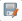 на панели редактирования.


Для отрисовки сторон хода нужно зайти в режим редактирования соответствующего слоя. При векторизации объектов часто возникает необходимость пристыковать вершины одного объекта к вершинам другого объекта. Для корректной и комфортной пристыковки нужно включить панель Инструментов прилипания (**snapping**). Кнопка в виде магнита  активирует прилипание. Остальные кнопки на данной панели позволяют уточнить параметры прилипания, в том числе расстояние, на котором оно начинает действовать. Отрисуйте стороны с включенным режимом прилипания, нажимая на левую кнопку мыши для установки вершин и завершая отрисовку правой кнопкой мыши. Сохраните изменения.

> Обратите внимание, что каждая сторона теодолитного хода должна быть отдельным объектом.

Для черчения дуг углов включите панель **Shape Digitizing Toolbar**, нажав на пустое место верхней части окна QGIS правой кнопкой. На этой панели вам потребуется инструмент, который строит окружность по центральной точке и произвольной точки окружности (последний в списке).

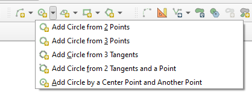


Чтобы превратить окружность в дугу, нужно взять инструмент разрезания  и нарисовать линию реза (закончить рисовку линии реза можно через нажатие правой кнопки мыши). Выберите объекты, которые хотите удалить, с помощью инструмента выделения  и нажмите **DELETE**.


### Настройка символики и подписей {#practice-theod-symbology}
[В начало справки ⇡](#practice-theod)


На схеме теодолитного хода следует различать точки самого хода и твёрдые точки, которые служат твёрдым направлением. Разная символика обуславливается разными значениями атрибутов данного класса в базе данных. Открыть атрибутивную таблицу слоя можно, нажав правой кнопкой мыши по нему и выбрав пункт **Open Attribute Table**.


Для редактирования атрибутов необходимо зайти в режим редактирования с помощью кнопки . Для добавления или удаления атрибутивных столбцов также необходимо зайтив в режим редактирования, после чего появятся соответствующие кнопки  и . Для того чтобы закодировать отличия точек хода и твердых точек, нужно создать новое атрибутивное поле и записать соответствующим точкам разные значения. Обратите внимание, что каждая строка в атрибутивной таблице – это, по сути, один объект в классе объектов. Выделять объекты в атрибутивной таблицы можно с помощью нажатия левой кнопки мыши по левому краю строки. Для выбора нескольких строк подряд можно «тянуть» выделение левой кнопкой мыши, либо выделить первый и последний объект с зажатым **SHIFT**. Для выбора нескольких отдельных строк зажмите **CTRL**. Выделяемые в атрибутивной таблице объекты будут подсвечиваться жёлтым цветом на карте. Для приближения к выбранному объекту нажмите на кнопку **Pan map to the selected rows** (**Увеличить карту до выделенных строк**) .


Для задания символики зайдите в свойства слоя точек, дважды по нему щёлкнув. Перейдите во вкладку **Symbology** (**Стиль**)


Сверху нужно выбрать способ символики **Categorized**, что позволяет категориально разделить символы по значению атрибута. В поле **Value** нужно указать название атрибута, по котором происходит разделение, после чего нажать на кнопку **Classify** внизу окна – в окне посередине у вас появятся все возможные категории, для каждой из которых можно задать свою символику. Дважды щёлкните по категории, чтобы задать символ.


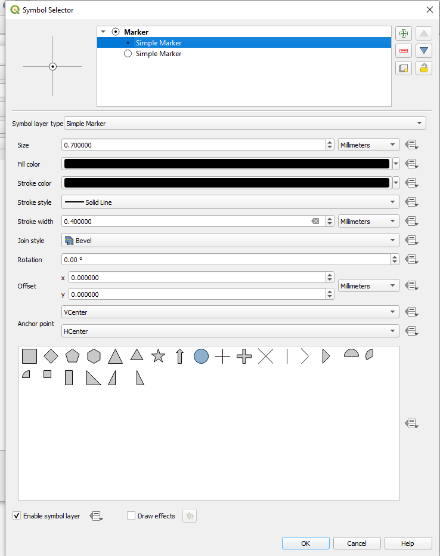


Построение символики в QGIS иерархическое – каждый символ может быть представлен набором слоёв символов. Например, для создания знака временного геодезического пункта (кружок с точкой в центре) вы можете задать два слоя. Верхний слой – точка, которую можно задать кругом чёрного цвета уменьшенного размера. Нижний слой – тот же круг, но уже большего размера с белой заливкой и чёрной обводкой.


Аналогично точкам мы можем разделить по символики стороны хода и твёрдое направление. Для последнего нужно задать два слоя с линией, у которой будет задан параметр **Offset**, то есть сдвиг от оси.


Подписи аналогично символике зависят от значений в атрибутивной колонке. Для включения подписей нужно зайти в свойствах во вкладку **Labels**. Там вы можете включить подписи, выбрав **Single Symbol** и указав атрибутивную колонку, откуда будут браться значения (**Value**), а также гарнитуру, кегль шрифта и прочие настройки форматирования. Во вкладке **Placement** вы можете указать способ размещения подписей относительно объекта.


Не забывайте изменять изменения в самом проекте (они касаются набора слоев, их оформления, некоторых параметров) с помощью кнопки .


### Настройка макета компоновки {#practice-theod-layout}
[В начало справки ⇡](#practice-theod)


Для создания макета компоновки схемы теодолитного хода, то есть того, как схема будет выглядеть на листе бумаги, нужно вызвать **Project – Layout Manager**. В открывшемся окне нажмите на кнопку создания макета и задайте имя для него. После этого перед вами появится макет компоновки, который вы можете наполнить необходимыми элементами с помощью специальных кнопок слева.


 
После добавления элементов схемы их перечень появляется в окошке справа вверху. Если выделить элемент, ниже открываются его свойства. Выделите элемент карты, запишите в его свойства масштаб. Систему координат выставить – **WGS 1984 UTM 37N**. В разделе Сетки нажмите на плюсик, чтобы добавить сетку. Выделив сетку и нажав на кнопку **Modify Grid**, мы можем редактировать её отображение.


 
В свойствах сетки выберите вид сетки – **Cross** (**перекрестие**), укажите шаг сетки, цвет линии – зеленый. В разделе **Frame** выберите **interior ticks** для показа выходов сетки внутрь рамки. Длину выходов можно установить 3 мм.


В разделе **Draw Coordinates** сориентируйте боковые подписи выходов сетки вертикально вдоль рамки.


Для настройки рамки создайте ещё одну сетку, нажав на плюс в основных свойствах картографического изображения, затем нажмите на кнопку **Modify Grid** и настройте отображение рамки соответствующим образом.


Для экспорта растрового изображения выберите **Layout – Export as …**.


## Создание схемы нивелирного хода
[В начало справки ⇡](#practice)


### Шаблон схемы нивелирного хода {#practice-level-template}


[Схема нивелирного хода в формате PDF](https://disk.yandex.ru/i/vxkXew-pAmtdRg){target="_blank"}


[Проект шаблона схемы нивелирного хода для QGIS](https://disk.yandex.ru/d/frDDrler8BldDQ){target="_blank"}


### Работа с базой данных {#practice-level-DB}

Для схемы нивелирного хода следует создать отдельную базу данных, в которой будет два класса объектов:

●	Стороны хода;

●	Точки хода.

Как создавать базу данных, можно посмотреть в разделе про [теодолитный ход](#practice-theod-DB).


### Настройка символики и подписей {#practice-level-symbology}
[В начало справки ⇡](#practice-level)


Аналогично тому, как это делалось для теодолитного хода, вы можете оформить объекты на схеме нивелирного хода. Помните о том, что на схеме следует использовать разные символы для твёрдых точек, собственно точек хода и иксовых (дополнительных) точек. Аналогично следует различать собственно стороны хода и стороны хода, примыкающие к иксовым точкам.

Для того чтобы показать направление измерений для сторон нужно установить стрелку. Это можно сделать, зайдя в настройки символики слоя и добавив слой маркеров. В качестве маркера выбирается соответствующий символ стрелки, настраивается его размер и указывается его положение в центральной точке линии.


В схеме нивелирного хода можно использовать некоторые возможности оформления подписей в дополнение к описанным в [разделе](#practice-theod-symbology).

1) Показ знака «+» перед положительными значениями превышений. Для этого разделе форматирования в свойствах подписей нужно включить соответствующую опцию и указать поле, по которому будет присваиваться символ.


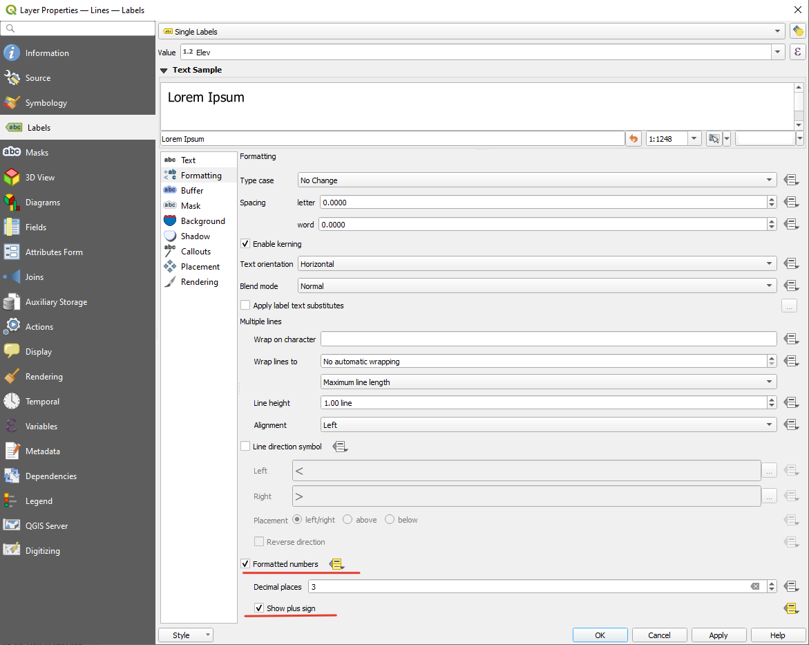


2) Добавление двух подписей к одному объекту: название точки и её высота. Для этого необходимо в свойствах подписей выбрать **Rule-based labeling** в самом верху окна. Добавьте два правила и для каждого задайте свой атрибут в качестве источника подписей. В разделе **Placement** вы можете задать разное относительное размещение подписей, а также задать сдвиг (**offset**) для подписей.


### Настройка макета компоновки {#practice-level-layout}
[В начало справки ⇡](#practice-level)


Настройте макет компоновки аналогично тому, как это описано в разделе про [теодолитный ход](#practice-theod-layout) и экспортируйте результат в PDF.


## Создание топографического плана {#practice-topo}
[В начало справки ⇡](#practice)


### Подгрузка пикетов тахеометрической съёмки {#practice-topo-csv-table-reading}
[В начало справки ⇡](#practice-topo)


QGIS может читать данные в разном формате: векторном, растровом, табличном и других.

Подготовьте таблицу формата CSV, где будут содержаться данные по каждому пикету тахеометрии. Все инструменты для чтения различных форматов данных стандартно расположены на панели слева. Для чтения CSV-таблицы используйте иконку в виде запятой.


> Примечание: Если у вас такой панели не оказалось, это значит, что она отключена. Для включения панели щелкните правой кнопкой мыши по пустому месту на панели и найдите **Manage Layers Toolbar**.

В открывшемся окне **Data Source Manager | Delimited Text** укажите путь к CSV-файлу. В разделе Формат файла выберите или пропишите разделитель колонок в файле. Если разделитель указан верно, внизу в окошке предпросмотра (**Sample Data**) вы увидите данные ячеек, разнесенные по соответствующим колонкам. При необходимости, если в текстовых полях вы видите непонятные символы, поменяйте кодировку (обычно это либо UTF-8, либо windows-1251). 

В разделе **Geometry Definition** мы указываем поле с геометрией объекта. Если файл CSV содержит координаты X и Y точек, то необходимо выбрать их соответствующее название из выпадающего списка напротив **X field** и **Y field**. Обращаем ваше внимание на то, что в QGIS, как и во всех ГИС-пакетах, реализована правая декартова система координат, то есть x (easting) – направлен на восток, y (northing) направлен на север. Ваши исходные данные могут быть с по-иному заданными осями.

В окошке **Geometry CRS** (**Система координат геометрии**) необходимо указать правильную систему координат, в которую изначально подразумеваются ваши исходные данные. Если неправильно задать систему координат, объекты окажутся не в том месте, где хотелось бы их видеть.
После того, как были заданы все необходимые параметры, должна активироваться кнопка **Add** (**Добавить**) внизу окна. Если она не активирована, вероятно, есть ошибка при чтении данных, например, в исходной таблице неправильно указан десятичный разделитель (точка или запятая в зависимости от настроек операционной системы).

В окне карты должны появиться точечные объекты. Для удобства работы с сними можно добавить подписи этих точек. Для этого нужно зайти в свойства слоя (дважды щёлкнуть по слою), найти пункт **Labels** и выбрать **Single labels**. В окне **Value** выбирается имя поля атрибутивной таблицы, по которому мы хотим получить подписи. Если вы хотите сделать сложную подпись на основе нескольких строк, нажмите на кнопку , откроется конструктор выражений. В среднем окне можно найти пункт Поля и значения. Двойной щелчок по имени поля добавляет его в выражение. Соединение значений полей осуществляется посредством конкатенации строк. Для этого используется символ . Например, если мы хотим вывести подпись по коду точки и по ее описанию, это может выглядеть так:
_“Code” || “ ” “Description”_


**Сохраните проект.**


### Создание базы данных для топографического плана {#practice-topo-database}
[В начало справки ⇡](#practice-topo)

QGIS поддерживает различные форматы пространственных данных. Среди них наиболее удобным для хранения и работы считается формат **Geopackage**. По сути это формат базы пространственных данных, внутри которой мы можем складывать различные классы объектов.


> Под классом объектов подразумевается набор объектов одного типа геометрии со схожей семантической (смысловой) нагрузкой. Очень важно, чтобы в пределах одного класса объектов не было пересечений объектов. Например, полигоны луговой и высокотравной растительности могут быть отнесены к одному классу объектов, а полигональные объекты гидрографии к другому.


Для создания базы данных формата **Geopackage** откройте окно Браузера внутри QGIS. Если его нет, включите его в выпадающем списке при щелчке правой кнопкой мыши по пустой панели. Найдите каталог, в котором вы хотите создать базу данных (лучше всего, чтобы путь к этой базы состоял из символов латинского алфавита, не содержал дефисов, пробелов и спецсимволов). Правой кнопкой мыши щелкните по каталогу, выберете **New – Geopackage**. Откроется окно, которое помимо самой базы данных предложит создать слой внутри неё. В поле Имя таблицы введите имя класса объектов латинскими символами, лучше, чтобы это был английский перевод соответствующего вида картографируемого объекта, а не транслитерация.


В поле **Geometry type** укажите соответствующую геометрию объектов (тип локализации на плане): точки, линии или полигоны. Обратите внимание, что каждый класс объектов поддерживает только один тип геометрии. Укажите спроецированную систему координат. Если указать геодезическую систему координат, например *WGS 1984*, то велика вероятность, что при векторизации объектов возникнут курьёзные ситуации.
В разделе **New Field** можно указать имя, типа и длину атрибутивного поля создаваемого класса объектов.


Поскольку мы создаем план не небольшую территорию, позволительно будет создать для каждого вида объекта отдельный класс внутри базы. Каждый последующий класс объектов создавайте внутри базы данных. Таким образом вы сформируете единое хранилище для всех картографируемых объектов.


### Векторизация {#practice-topo-vectorization}
[В начало справки ⇡](#practice-topo)


Созданные классы объектов в базе данных можно добавить в перечень слоев проекта простым перетаскиванием. Для редактирования объектов и добавления новых объектов в класс необходимо войти в режим редактирования. Для этого можно щелкнуть правой кнопкой мыши по слою и выбрать пункт **Toggle Editing**, либо выделить слой и найти на панели инструментов кнопку . Активация режима редактирования откроет некоторые другие кнопки на панелях. Например, для полигонального объекта появится кнопка 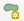, с помощью которой можно создать новый полигон в слое. Для других типов геометрии иконка будет немного отличаться.


Рисовка контура осуществляется с помощью левой кнопки мыши. Для завершения объекта нажмите правую кнопку мыши. Для редактирования отдельных вершин нажмите на кнопку . После этого у объекта кружочками выделятся вершины.


Курсор в таком режиме может вести себя тремя разными способами:


1)	При выделении вершины вы можете изменить её положение;


2)	При выделении ребра вы можете сдвинуть его вместе со смежными вершинами;


3)	При нажатии на плюсик в центре ребра добавляется новая вершина.


Нажатие на клавишу **delete** позволяет удалить вершину. При векторизации объектов часто возникает необходимость пристыковать вершины одного объекта к вершинам другого объекта. Для корректной и комфортной пристыковки нужно включить панель Инструменты прилипания (**snapping**). Кнопка в виде магнита  активирует прилипание. Остальные кнопки на данной панели позволяют уточнить параметры прилипания, в том числе расстояние, на котором оно начинает действовать.


Если вам необходимо повторить значительную часть существующего контура при создании нового, то удобнее всего воспользоваться трассировкой (**Tracing**), нажав на кнопку  на панели инструментов прилипания. После этого при ведении на небольшом расстоянии от контура новый контур будет автоматически пристыковываться к существующем.


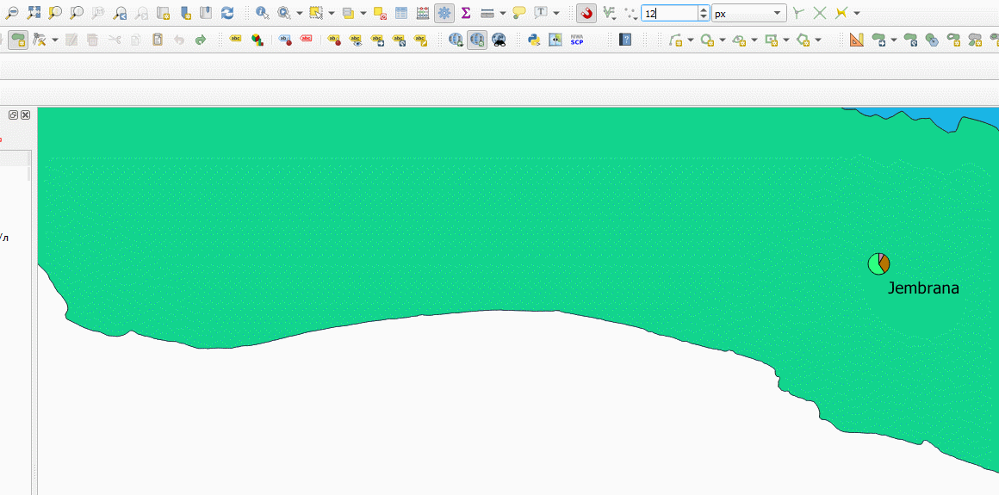


_Advanced Digitizing Toolbar_


Соответствующую панель вы так же, как и предыдущую, можете найти в выпадающем списке панелей.


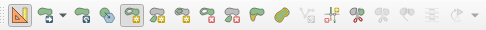


На данной панели доступны инструменты для для перемещения объектов , создания внутренних колец (по сути – вырезание дырки в полигоне) , разрезания объектов , склеивания объектов , изменения направления линии 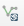 и другие.


Выбрать объекты, например, для склеивания можно с помощью инструмента выделения .


Не забывайте регулярно сохранять изменения в геометрии слоев с помощью кнопки на панели . Также не забывайте изменять изменения в самом проекте (они касаются набора слоев, их оформления, некоторых параметров) с помощью кнопки .


### Оформление в условных знаках {#practice-topo-symbols}
[В начало справки ⇡](#practice-topo)


Для работы с оформлением топографического плана скачайте [символы](https://yadi.sk/d/mb1wTvAUUAgVUQ){target="_blank"} и [топографические шрифты](https://yadi.sk/d/G_3EVFLqg3C5pA){target="_blank"}, а также [условные обозначения 2005 года](https://yadi.sk/i/4EpTOHEhQdVq9g){target="_blank"} и [условные обозначения 1989 года](https://disk.yandex.ru/i/_WJi-PJUXlZi3Q){target="_blank"}.


Переместите папку со скаченными символами в удобную для использования директорию. Затем в основном меню QGIS выберите **Settings – Options...**. В открывшемся окне глобальных настроек перейдите во вкладку **System** и выберите раздел **SVG Paths**. Нажмите на плюс и добавьте путь к набору векторных символов.


Для оформления слоёв проекта в условных знаках необходимо дважды щёлкнуть по слою. Откроются его свойства, среди которых в данный момент нас интересует **Symbology**. Для точечного слоя по умолчанию будет выставлен **Marker – Simple Marker**.


С ним особо ничего не сделаешь – можно поменять геометрическую фигуру, изменить размер или цвет. Для использования более разнообразной библиотеки символов нужно в типе слоя выбрать **SVG Marker**.


При выборе символа внизу появляется адрес к данному символу у вас на компьютере. Размер символа и его цвет вы можете настраивать в этом же окне.

Для площадных объектов всё работает похоже, но немного сложнее. По умолчанию для таких слоёв даётся заливка цветом, которую можно менять. Дополнительно можно менять обводку. Для того чтобы заполнить наши площадные объекты штриховкой из специальных символов, например, газона или луговой растительности, нужно выбрать заливку маркерами **Fill – Point Pattern Fill – Marker**. Простой маркер замените на **SVG Marker** и укажите соответствующий символ из скаченной библиотеки. Задайте размеры символа согласно условным знакам. Имейте в виду, что по умолчанию ширина и высота символа меняются пропорционально, но если нажать на замок справа, то вы сможете произвольно масштабировать символ.


Для настройки шага (частоты) маркеров необходимо выделить **Point Pattern Fill** в иерархии структуры стиля. Введите значения вертикального и горизонтального расстояния согласно принятым условным обозначениям. Обратите внимание, что вы можете указать единицы измерения в миллиметрах. Для того чтобы выставить маркеры в шахматном порядке можно задать параметр **Displacement** по горизонтали или по вертикали.


Для получения случайного заполнения маркерами используйте соответствующую опцию **Random Marker Fill**. Например, для обозначения леса можно использовать простой маркер в виде круга с белой заливкой и чёрной обводкой. Укажите способ расчёта (**Count Method**) через плотность. Параметр **Seed** - это стартовое число для генерирования случайных последовательностей.


**Детальные настройки символов сверяйте с Условными обозначениями, проверяйте, как они выглядят в режиме макета.**


### Автоматизация создания некоторых объектов на топографических планах {#practice-topo-tips_tricks}
[В начало справки ⇡](#practice-topo)


#### Создание площадного объекта дороги {#practice-topo-tips_tricks-roads}


Обычно дороги при топографической съёмке отбиваются по осевой линии, если у них известная и постоянная ширина. Чтобы наиболее эффективно и быстро построить площадной знак дороги по таким исходным данным, можно воспользоваться одним из инструментов геообработки QGIS, который строит буферные зоны. Для этого щёлкните правой кнопкой мыши по пустому полю верхней панели программы, чтобы увидеть список окон и панелей. Выберите панель **Processing Toolbox Panel**. Это панель со всеми инструментами геообработки. Через поисковую строку панели найдите инструмент **Buffer**. Дважды щёлкните по инструменту, после чего откроется окно.


В окне необходимо задать параметры: входной линейный класс объектов, т. е. ось дороги; **Distance** – радиус буферной зоны, определяющий половину ширины дороги; параметр **End Cap Style** позволяет установить стиль окончания буфера; галочка **Dissolve Result** позволяет склеить несколько буферных зон в один объект. В параметр **Buffered** вводится выходной класс объектов. Чтобы выходной класс был не временным, а постоянным, выберите справа опцию **Save to Geopackage**, укажите путь к вашей базе данных, после чего откроется маленькое окно, куда предлагается ввести название выходного класса.


Условный знак просёлочных и полевых дорог в масштабе 1:500 представляет собой полигон с двумя разными стилями обводки – сплошной и штриховой. Проще всего такой условный знак построить, конвертировав полигон в линии с помощью инструмента **Polygons to lines**. Найдите его через поиск в панели инструментов геообработки.


Сохраните выходной линейный класс объектов в базе данных, отредактируйте его геометрию (порежьте на сегменты, удалите лишние сегменты) и присвойте линиям разную символику в зависимости от значения атрибута. Для этого зайдите в свойства символики слоя и выберите способ символики **Categorized**, после чего нажмите на кнопку **Classify**, и у вас появтся разные стили линий, в зависимости от значения атрибута. Для штриховой линии в настройках символа **Simple Line** включите галочку **Use custom dash pattern**. Здесь вы можете задать длину штриха и длину пробела согласно принятым условным обозначениям


#### Создание объекта границы растительности {#practice-topo-tips_tricks-vegetation-borders}
[В начало справки ⇡](#practice-topo)


Границы растительности и грунтов обозначаются пунктирной линией, но если настраивать стандартным образом обводку у полигонов соответствующих объектов, то при стыковке двух полигонов произойдёт наложение границ. Именно поэтому границы должны существовать в виде отдельного класса объекта. Для этого можно воспользоваться инструментом **Polygons to lines** и удалив дублирующие сегменты.


### Обработка высотных данных {#practice-topo-elevation}
[В начало справки ⇡](#practice-topo)


При построении топографического плана горизонтали можно проводить вручную, а можно попробовать получить их автоматически на основе цифровой модели рельефа. В рамках учебной практики вы попробуете оба варианта и оцените достоверность и точность каждого.


> Цифровая модель рельефа (Digital Elevation Model) – это растр, каждый пиксель которого кодирует высоту.


Для построения ЦМР в QGIS на основе данных тахеометрической съёмки можно использовать инструмент ГИС-пакета SAGA, который доступен через интерфейс QGIS. Для этого в панели **Processing Toolbox Panel** через поисковую строку найдите инструмент **Natural neighbour**. Это инструмент линейной интерполяции точечных данных на основе триангуляции. Среди параметров инструмента важно указать разрешение итоговой модели.


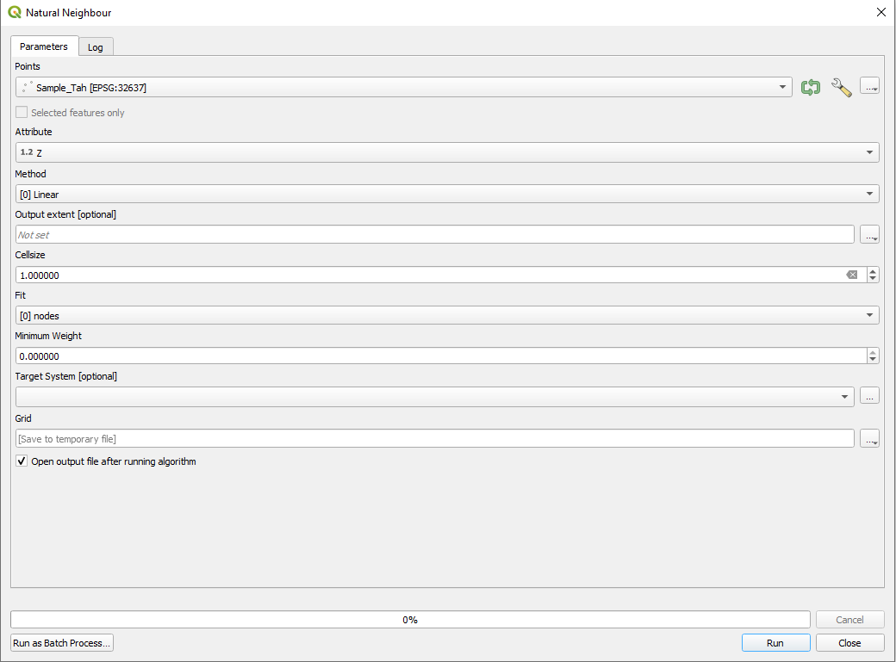


Для извлечения из ЦМР горизонталей следует воспользоваться другим инструментом – **Contour** – его так же можно найти через поиск.


Самый важный параметр, который следует указать в интерфейсе этого инструмента – сечение горизонталей (**Interval between contour lines**).


Для настройки подписей горизонталей зайдите в свойства слоя во вкладку **Labels**.


В разделе **Text** можно указать гарнитуру, кегль. В разделе **Buffer** можно включить т.н. гало, т. е. обводку вокруг символов, которая закрывает собой горизонтали. В разделе **Placement** в свойстве **Mode** указывается **Curved**, т. е. подпись по кривой, а также включается размещение **on line**, чтобы подпись лежала на горизонтали.


### Оформление макета {#practice-topo-layout}
[В начало справки ⇡](#practice-topo)


[Пример оформления макета топографического плана](https://disk.yandex.ru/d/rWXOQug9ts11fQ){target="_blank"}


С основами создания и оформления макета компоновки можно ознакомиться в разделе по [теодолитному ходу](#practice-theod-layout). Вы можете скачать шаблон оформления макета топографического плана и поменять его экстент в соответствии со своей территорией (по ссылке выше скачайте файл с расширением *.qpt). 

Загрузить шаблон оформления макета можно, вызвав через меню менеджер макетов (**Project – Layout Manager**). В открывшемся окне выберите создание макета на основе конкретного шаблона (**Specific**). Задайте путь к файлу QPT. Нажмите на кнопку **Create**.


Чтобы поменять охват территории, зайдите в свойства элемента карты и поменяйте значения координат экстента (охвата) под свою территорию, введя максимальные, а затем минимальные координаты по обеим осям.

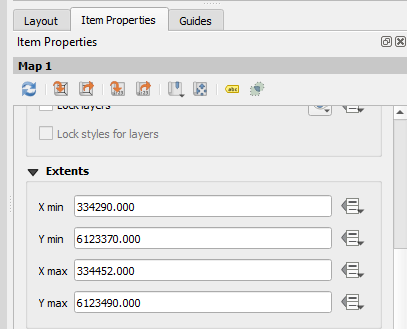

> Обратите внимание, что в зависимости от предыдущих значений координат экстента, у вас может не с первого раза получиться ввести свои координаты, поэтому введите их повторно.

Изменить размер листа можно щелчком правой кнопкой мыши по листу. После этого справа откроются свойства элемента, где можно указать размеры листа.


Рамка топографической карты состоит из внутренней тонкой и внешней толстой рамки. Обе рамки можно по отдельности добавить в свойствах элемента.

Для того чтобы сделать подписи координат приближенными к стандартным в настройках, нужно зайти в свойства сетки. Сделаем, например, так, что последние три цифры координат будут подписываться всегда, остальные же только на крайних на листе выходах сетки. Выберем для подписи последних трёх цифр внутренню рамку, зайдём в раздел **Draw Coordinates** и в пункте **Format** укажем **Custom**. После нажатия на кнопку выражения, перед вами откроется окно, где нужно написать выражение *right(to_string(\@grid_number), 3)*.


Для того чтобы сделать подписи первых частей координат у крайних выходов сетки, нужно зайти в настройки внешней рамки и по аналогии с предыдущим указать пользовательский формат подписи. В окне выражения нужно написать *left(to_string(\@grid_number), length(to_string(\@grid_number)) - 3)*. Чтобы подписывались только крайние выходы сетки, нужно в разделе **Appearance** задать свойства **Interval**, исходя из охвата вашей карты, и свойства **Offset**, исходя из значений координат крайней левой и крайней нижней линии сетки.


Обратите внимание, что согласно условным обозначениям у всех текстовых элементов есть определённые шрифты, которые вы можете установить и задать для вашей карты.


## Привязка и дешифрирование космического снимка {#practice-georeference}
[В начало справки ⇡](#practice)


### Исходные данные {#practice-georeference-data}


[Снимок Keyhole 1973 года для привязки по наземным опорным точкам](https://disk.yandex.ru/i/7a93zQEgNnI4dA){target="_blank"}

Снимки для дешифрирования

[Снимок Digital Globe 2018 года. Участок 1](https://disk.yandex.ru/i/bIn38XOCT92FXA){target="_blank"}


[Снимок Digital Globe 2018 года. Участок 2](https://disk.yandex.ru/i/_VykXwJloU-0yA){target="_blank"}


[Снимок Digital Globe 2018 года. Участок 3](https://disk.yandex.ru/i/D0-eTUvb3eX_1w){target="_blank"}


### Сброс данных со спутниковых навигаторов {#practice-georeference-gpx}

Для сброса данных со спутниковых навигаторов подключите их через интерфейс mini usb к компьютеру. Откроется окно проводника **Garmin**. Зайдите в папку **GPX** и скопируйте путевые точки. Из папки **Current** скопируйте текущий трек.


### Привязка по наземным опорным точкам {#practice-georeference-gcp}


Добавьте снимок в проект, нажав на кнопку . Поскольку добавленный снимок на данный момент не привязан, справа от слоя в таблице слоёв вы увидите знак вопроса.

> Если вы не видите снимок, то, вероятно, он расположился где-то за пределами вашего экрана. Чтобы увидеть его, нажмите правой кнопкой мыши по слою и выберете **Zoom to Layer** (**Увеличить до слоя**). Обратите внимание на значения координат и масштаб внизу окна. Что они могут означать?

Запустите модуль привязки через меню **Layer – Georeferencer** (**Слои – Привязка растров...**).


> Если вы не видите такого пункта меню, то зайдите в **Plugins – Manage and Install plugins...** (**Установки – Модули и управление модулями**), найдите через поиск и включите соответствующий модуль, поставив галочку (с версии 3.16 этот модуль по умолчанию встроен в QGIS).


Откроется отдельное окно привязки. Нажмите на кнопку **Открыть растр** , добавьте привязываемый растр. Щелчок левой кнопкой мыши по привязываемому изображению в месте потенциального размещения опорной точки откроет окно, куда будет предложено ввести координаты. При использовании наземных опорных точек, отмеченных в ходе маршрута на навигации, введите координату **X** в окно **Easting** и **Y** в окно **Northing**.

> При работе на полигоне Чашниково координаты СК проекции WGS 1984 UTM 37N **Northing** начинаются с цифр *621*, координаты **Easting** с *38*.

Если в вашей версии QGIS в открывшемся окне есть опция выбора системы координат, укажите **правильную**.


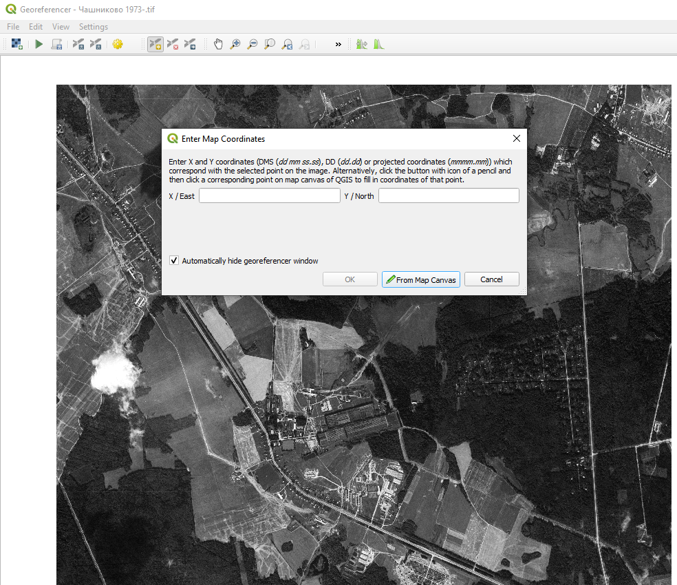


> Обратите внимание, что оси X и Y в геоинформационном программном обеспечении ориентированы как в математике. Для координаты X вводить номер зоны **не нужно**.


После расстановки точек внизу окна появится таблица с вашими точками привязки – будут указаны координаты этих точек в исходной СК изображения и в целевой СК, а также невязки. Далее необходимо указать способ трансформации для расчёта невязок. Нажмите на кнопку . В качестве типа трансформации для снимка может подойти полиномиальное преобразование первой степени (минимально необходимо 3 опорные точки) или проективное преобразование (минимально необходимо 4 опорные точки). Укажите целевую систему координат (в которой вводились координаты точек), а также путь для сохраняемого файла.

Убедитесь в том, что стоит галка напротив опции **Use 0 for transparency when needed**, чтоб у вас не было чёрной рамки вокруг привязанного растра.

> Сохраняйте файлы в папку с путями без латиницы, пробелов и спецсимволов.


После добавления трансформированного изображения в основное окно карты убедитесь в правильности проделанной операции, сравнивая его с подложкой из мозаики спутниковых снимков. Для этого удобно использовать инструмент шторки.

Зайдите в **Модули – Управление и установка модулей...** и вбейте в поиск **MapSwipe Tool**. После этого появится панель шторки.

Выберите слой, который будет активен в режиме шторки (будет находиться под шторкой) и нажмите на кнопку .


### Дешифрирование снимка {#practice-georeference-interpretation}

Для дешифрирования космических снимков необходимо осуществить их привязку. В случае с современными космическими снимками это можно сделать на основе подложки картографических веб-сервисов.

Для привязки данных дистанционного зондирования в QGIS можно использовать WMS-сервис с мозаикой спутниковых снимков. Для включения мозаики зайдите в меню **Модули – Управление и установка модулей...**. Впишите в строку поиска __QuickMapServices__. Установите модуль.

Откроется окно модуля. В окне поиска геосервиса введите __Google satelite__ или какой-либо еще картографический веб-сервис со спутниковой подложкой. Нажмите **Добавить**.


Добавьте в качестве слоя данных привязываемый снимок.

> Примечание: Если у вас такой панели не оказалось, это значит, что она отключена. Для включения панели щелкните правой кнопкой мыши по пустому месту на панели и найдите **панель работы со слоями**.

Процесс дешифрирования представляет собой создание базы данных и векторизацию объектов по данным космической съёмки. О том, как это делается, вы можете узнать из раздела 7.3.2 и 7.3.3.

----
_Карпачевский А.М._ **Топография с основами картографии**. М.: Географический факультет МГУ, `r lubridate::year(Sys.Date())`.
----

<!--chapter:end:Ref10_Practice.Rmd-->

